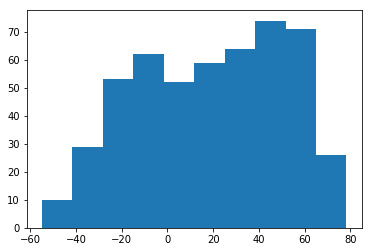
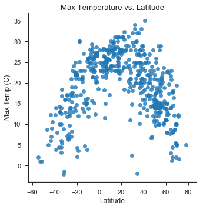
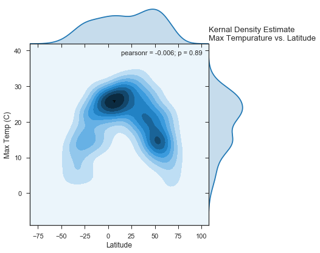
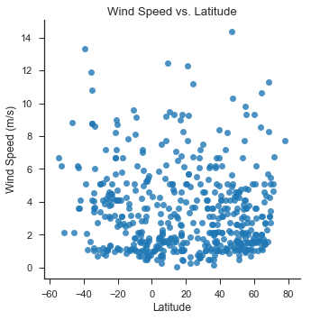
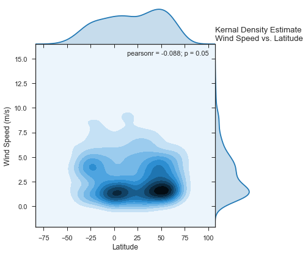
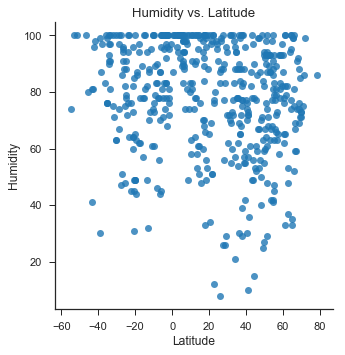
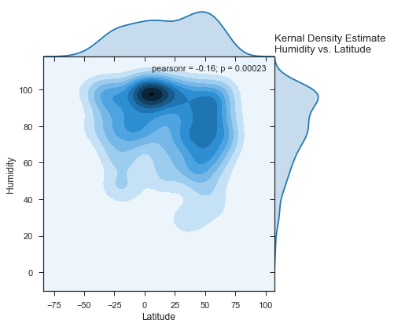
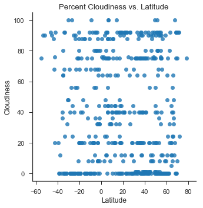
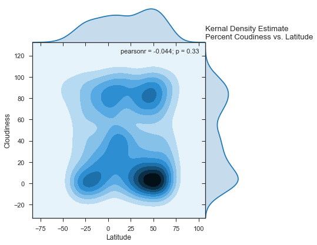

```python
# import dependencies
import numpy as np
import pandas as pd
import matplotlib.pyplot as plt
import seaborn as sns
from citipy import citipy
import requests
import json
from config import api_key
import time
import openweathermapy.core as owm
```


```python
# Setting parameters for Api call
settings = {"units": "metric", "appid": api_key}
```


```python
# Randomly select latitudes and longitudes for city search
np.random.seed(seed=3)
lat = np.random.uniform(-90.0,90.0, size=5000)
lng = np.random.uniform(-180.0,180.0, size=5000)

coord = [(lat[i], lng[i]) for i in range(len(lat))]
len(coord)
```


    5000


```python
# Get nearest cities to latitude and longitude 
cities = [(citipy.nearest_city(lat[i], lng[i]).city_name ,
           citipy.nearest_city(lat[i], lng[i]).country_code) 
           for i in range(len(lat))
         ]
# cut out duplicate cities from list
cities = list(set(cities))
# set up base url for api request
base_url = "http://api.openweathermap.org/data/2.5/weather?appid=" + api_key + '&units=metric'
# initialize empty list for data of interest
latitude = []
longitude = []
max_temp = []
wind_speed = []
humidity = []
cloudiness = []
city_name = []
country_code = []
#Initialize counter
i=1
print(
      'Beginning Data Retrieval',
      '\n-----------------------------------------------------'
     )
# loop throught cities
for city in cities:
    # sleep for on second so the 60 request per minute is held
    time.sleep(1)
    # make a request for each city
    city_and_code = city[0] + ',' + city[1]
    url = base_url + '&q=' + city_and_code
    weather = requests.get(url)
    weather_json = weather.json()
    # if request was successfull store data in each of the appropriate lists
    if '200' in str(weather):
        latitude.append(weather_json['coord']['lat'])
        longitude.append(weather_json['coord']['lon'])
        max_temp.append(weather_json['main']['temp_max'])
        humidity.append(weather_json['main']['humidity'])
        wind_speed.append(weather_json['wind']['speed'])
        cloudiness.append(weather_json['clouds']['all'])
        country_code.append(city[1])
        city_name.append(city[0])
        print('Processing Record ' + str(i) + '|' + city_and_code)
        print(url)
        # increment count if count is greater than 500 break loop
        i += 1
        if i > 500:
            break
        else:
            pass
    else:
        print(weather)
        continue

print(
      '-----------------------------------------------------',
      '\nData Retrieval Complete',
      '\n-----------------------------------------------------'
     )
```

    Beginning Data Retrieval 
    -----------------------------------------------------
    <Response [404]>
    Processing Record 1|bonnyville,ca
    http://api.openweathermap.org/data/2.5/weather?appid=365a23001211ffaefa89b28e8fa62797&units=metric&q=bonnyville,ca
    Processing Record 2|shingu,jp
    http://api.openweathermap.org/data/2.5/weather?appid=365a23001211ffaefa89b28e8fa62797&units=metric&q=shingu,jp
    Processing Record 3|bolobo,cd
    http://api.openweathermap.org/data/2.5/weather?appid=365a23001211ffaefa89b28e8fa62797&units=metric&q=bolobo,cd
    Processing Record 4|okhotsk,ru
    http://api.openweathermap.org/data/2.5/weather?appid=365a23001211ffaefa89b28e8fa62797&units=metric&q=okhotsk,ru
    Processing Record 5|breves,br
    http://api.openweathermap.org/data/2.5/weather?appid=365a23001211ffaefa89b28e8fa62797&units=metric&q=breves,br
    <Response [404]>
    Processing Record 6|tigzirt,dz
    http://api.openweathermap.org/data/2.5/weather?appid=365a23001211ffaefa89b28e8fa62797&units=metric&q=tigzirt,dz
    <Response [404]>
    Processing Record 7|weinan,cn
    http://api.openweathermap.org/data/2.5/weather?appid=365a23001211ffaefa89b28e8fa62797&units=metric&q=weinan,cn
    Processing Record 8|penticton,ca
    http://api.openweathermap.org/data/2.5/weather?appid=365a23001211ffaefa89b28e8fa62797&units=metric&q=penticton,ca
    Processing Record 9|buchanan,lr
    http://api.openweathermap.org/data/2.5/weather?appid=365a23001211ffaefa89b28e8fa62797&units=metric&q=buchanan,lr
    Processing Record 10|wanning,cn
    http://api.openweathermap.org/data/2.5/weather?appid=365a23001211ffaefa89b28e8fa62797&units=metric&q=wanning,cn
    Processing Record 11|khandyga,ru
    http://api.openweathermap.org/data/2.5/weather?appid=365a23001211ffaefa89b28e8fa62797&units=metric&q=khandyga,ru
    Processing Record 12|oistins,bb
    http://api.openweathermap.org/data/2.5/weather?appid=365a23001211ffaefa89b28e8fa62797&units=metric&q=oistins,bb
    Processing Record 13|carlisle,us
    http://api.openweathermap.org/data/2.5/weather?appid=365a23001211ffaefa89b28e8fa62797&units=metric&q=carlisle,us
    Processing Record 14|nerchinsk,ru
    http://api.openweathermap.org/data/2.5/weather?appid=365a23001211ffaefa89b28e8fa62797&units=metric&q=nerchinsk,ru
    <Response [404]>
    Processing Record 15|rabo de peixe,pt
    http://api.openweathermap.org/data/2.5/weather?appid=365a23001211ffaefa89b28e8fa62797&units=metric&q=rabo de peixe,pt
    <Response [404]>
    Processing Record 16|ahipara,nz
    http://api.openweathermap.org/data/2.5/weather?appid=365a23001211ffaefa89b28e8fa62797&units=metric&q=ahipara,nz
    Processing Record 17|ketchikan,us
    http://api.openweathermap.org/data/2.5/weather?appid=365a23001211ffaefa89b28e8fa62797&units=metric&q=ketchikan,us
    Processing Record 18|coahuayana,mx
    http://api.openweathermap.org/data/2.5/weather?appid=365a23001211ffaefa89b28e8fa62797&units=metric&q=coahuayana,mx
    Processing Record 19|huambo,ao
    http://api.openweathermap.org/data/2.5/weather?appid=365a23001211ffaefa89b28e8fa62797&units=metric&q=huambo,ao
    Processing Record 20|batticaloa,lk
    http://api.openweathermap.org/data/2.5/weather?appid=365a23001211ffaefa89b28e8fa62797&units=metric&q=batticaloa,lk
    Processing Record 21|plast,ru
    http://api.openweathermap.org/data/2.5/weather?appid=365a23001211ffaefa89b28e8fa62797&units=metric&q=plast,ru
    Processing Record 22|kuching,my
    http://api.openweathermap.org/data/2.5/weather?appid=365a23001211ffaefa89b28e8fa62797&units=metric&q=kuching,my
    Processing Record 23|roma,au
    http://api.openweathermap.org/data/2.5/weather?appid=365a23001211ffaefa89b28e8fa62797&units=metric&q=roma,au
    Processing Record 24|fort nelson,ca
    http://api.openweathermap.org/data/2.5/weather?appid=365a23001211ffaefa89b28e8fa62797&units=metric&q=fort nelson,ca
    Processing Record 25|lethem,gy
    http://api.openweathermap.org/data/2.5/weather?appid=365a23001211ffaefa89b28e8fa62797&units=metric&q=lethem,gy
    Processing Record 26|ossora,ru
    http://api.openweathermap.org/data/2.5/weather?appid=365a23001211ffaefa89b28e8fa62797&units=metric&q=ossora,ru
    Processing Record 27|yala,th
    http://api.openweathermap.org/data/2.5/weather?appid=365a23001211ffaefa89b28e8fa62797&units=metric&q=yala,th
    Processing Record 28|kathu,za
    http://api.openweathermap.org/data/2.5/weather?appid=365a23001211ffaefa89b28e8fa62797&units=metric&q=kathu,za
    Processing Record 29|buala,sb
    http://api.openweathermap.org/data/2.5/weather?appid=365a23001211ffaefa89b28e8fa62797&units=metric&q=buala,sb
    Processing Record 30|manhattan,us
    http://api.openweathermap.org/data/2.5/weather?appid=365a23001211ffaefa89b28e8fa62797&units=metric&q=manhattan,us
    Processing Record 31|pontes e lacerda,br
    http://api.openweathermap.org/data/2.5/weather?appid=365a23001211ffaefa89b28e8fa62797&units=metric&q=pontes e lacerda,br
    Processing Record 32|tanout,ne
    http://api.openweathermap.org/data/2.5/weather?appid=365a23001211ffaefa89b28e8fa62797&units=metric&q=tanout,ne
    Processing Record 33|neuquen,ar
    http://api.openweathermap.org/data/2.5/weather?appid=365a23001211ffaefa89b28e8fa62797&units=metric&q=neuquen,ar
    Processing Record 34|edea,cm
    http://api.openweathermap.org/data/2.5/weather?appid=365a23001211ffaefa89b28e8fa62797&units=metric&q=edea,cm
    Processing Record 35|necochea,ar
    http://api.openweathermap.org/data/2.5/weather?appid=365a23001211ffaefa89b28e8fa62797&units=metric&q=necochea,ar
    Processing Record 36|puerto carreno,co
    http://api.openweathermap.org/data/2.5/weather?appid=365a23001211ffaefa89b28e8fa62797&units=metric&q=puerto carreno,co
    <Response [404]>
    Processing Record 37|mandali,iq
    http://api.openweathermap.org/data/2.5/weather?appid=365a23001211ffaefa89b28e8fa62797&units=metric&q=mandali,iq
    <Response [404]>
    Processing Record 38|ewa beach,us
    http://api.openweathermap.org/data/2.5/weather?appid=365a23001211ffaefa89b28e8fa62797&units=metric&q=ewa beach,us
    Processing Record 39|meulaboh,id
    http://api.openweathermap.org/data/2.5/weather?appid=365a23001211ffaefa89b28e8fa62797&units=metric&q=meulaboh,id
    Processing Record 40|sarkand,kz
    http://api.openweathermap.org/data/2.5/weather?appid=365a23001211ffaefa89b28e8fa62797&units=metric&q=sarkand,kz
    Processing Record 41|samarai,pg
    http://api.openweathermap.org/data/2.5/weather?appid=365a23001211ffaefa89b28e8fa62797&units=metric&q=samarai,pg
    Processing Record 42|grenville,gd
    http://api.openweathermap.org/data/2.5/weather?appid=365a23001211ffaefa89b28e8fa62797&units=metric&q=grenville,gd
    Processing Record 43|sinnamary,gf
    http://api.openweathermap.org/data/2.5/weather?appid=365a23001211ffaefa89b28e8fa62797&units=metric&q=sinnamary,gf
    Processing Record 44|sandovo,ru
    http://api.openweathermap.org/data/2.5/weather?appid=365a23001211ffaefa89b28e8fa62797&units=metric&q=sandovo,ru
    Processing Record 45|itatskiy,ru
    http://api.openweathermap.org/data/2.5/weather?appid=365a23001211ffaefa89b28e8fa62797&units=metric&q=itatskiy,ru
    <Response [404]>
    Processing Record 46|makakilo city,us
    http://api.openweathermap.org/data/2.5/weather?appid=365a23001211ffaefa89b28e8fa62797&units=metric&q=makakilo city,us
    Processing Record 47|vaini,to
    http://api.openweathermap.org/data/2.5/weather?appid=365a23001211ffaefa89b28e8fa62797&units=metric&q=vaini,to
    Processing Record 48|namatanai,pg
    http://api.openweathermap.org/data/2.5/weather?appid=365a23001211ffaefa89b28e8fa62797&units=metric&q=namatanai,pg
    Processing Record 49|bujumbura,bi
    http://api.openweathermap.org/data/2.5/weather?appid=365a23001211ffaefa89b28e8fa62797&units=metric&q=bujumbura,bi
    Processing Record 50|zhezkazgan,kz
    http://api.openweathermap.org/data/2.5/weather?appid=365a23001211ffaefa89b28e8fa62797&units=metric&q=zhezkazgan,kz
    Processing Record 51|cap-aux-meules,ca
    http://api.openweathermap.org/data/2.5/weather?appid=365a23001211ffaefa89b28e8fa62797&units=metric&q=cap-aux-meules,ca
    Processing Record 52|sao felix do xingu,br
    http://api.openweathermap.org/data/2.5/weather?appid=365a23001211ffaefa89b28e8fa62797&units=metric&q=sao felix do xingu,br
    Processing Record 53|manaus,br
    http://api.openweathermap.org/data/2.5/weather?appid=365a23001211ffaefa89b28e8fa62797&units=metric&q=manaus,br
    Processing Record 54|sola,vu
    http://api.openweathermap.org/data/2.5/weather?appid=365a23001211ffaefa89b28e8fa62797&units=metric&q=sola,vu
    <Response [404]>
    <Response [404]>
    Processing Record 55|maracaibo,ve
    http://api.openweathermap.org/data/2.5/weather?appid=365a23001211ffaefa89b28e8fa62797&units=metric&q=maracaibo,ve
    Processing Record 56|kizukuri,jp
    http://api.openweathermap.org/data/2.5/weather?appid=365a23001211ffaefa89b28e8fa62797&units=metric&q=kizukuri,jp
    Processing Record 57|panguna,pg
    http://api.openweathermap.org/data/2.5/weather?appid=365a23001211ffaefa89b28e8fa62797&units=metric&q=panguna,pg
    Processing Record 58|tura,ru
    http://api.openweathermap.org/data/2.5/weather?appid=365a23001211ffaefa89b28e8fa62797&units=metric&q=tura,ru
    Processing Record 59|vicente guerrero,mx
    http://api.openweathermap.org/data/2.5/weather?appid=365a23001211ffaefa89b28e8fa62797&units=metric&q=vicente guerrero,mx
    Processing Record 60|inhambane,mz
    http://api.openweathermap.org/data/2.5/weather?appid=365a23001211ffaefa89b28e8fa62797&units=metric&q=inhambane,mz
    Processing Record 61|marfino,ru
    http://api.openweathermap.org/data/2.5/weather?appid=365a23001211ffaefa89b28e8fa62797&units=metric&q=marfino,ru
    Processing Record 62|aljezur,pt
    http://api.openweathermap.org/data/2.5/weather?appid=365a23001211ffaefa89b28e8fa62797&units=metric&q=aljezur,pt
    Processing Record 63|portsmouth,us
    http://api.openweathermap.org/data/2.5/weather?appid=365a23001211ffaefa89b28e8fa62797&units=metric&q=portsmouth,us
    Processing Record 64|chapais,ca
    http://api.openweathermap.org/data/2.5/weather?appid=365a23001211ffaefa89b28e8fa62797&units=metric&q=chapais,ca
    Processing Record 65|baft,ir
    http://api.openweathermap.org/data/2.5/weather?appid=365a23001211ffaefa89b28e8fa62797&units=metric&q=baft,ir
    Processing Record 66|beloha,mg
    http://api.openweathermap.org/data/2.5/weather?appid=365a23001211ffaefa89b28e8fa62797&units=metric&q=beloha,mg
    Processing Record 67|ancud,cl
    http://api.openweathermap.org/data/2.5/weather?appid=365a23001211ffaefa89b28e8fa62797&units=metric&q=ancud,cl
    Processing Record 68|kovdor,ru
    http://api.openweathermap.org/data/2.5/weather?appid=365a23001211ffaefa89b28e8fa62797&units=metric&q=kovdor,ru
    Processing Record 69|sechura,pe
    http://api.openweathermap.org/data/2.5/weather?appid=365a23001211ffaefa89b28e8fa62797&units=metric&q=sechura,pe
    Processing Record 70|savyntsi,ua
    http://api.openweathermap.org/data/2.5/weather?appid=365a23001211ffaefa89b28e8fa62797&units=metric&q=savyntsi,ua
    Processing Record 71|yacuiba,bo
    http://api.openweathermap.org/data/2.5/weather?appid=365a23001211ffaefa89b28e8fa62797&units=metric&q=yacuiba,bo
    Processing Record 72|oakdale,us
    http://api.openweathermap.org/data/2.5/weather?appid=365a23001211ffaefa89b28e8fa62797&units=metric&q=oakdale,us
    Processing Record 73|murgab,tm
    http://api.openweathermap.org/data/2.5/weather?appid=365a23001211ffaefa89b28e8fa62797&units=metric&q=murgab,tm
    Processing Record 74|tawang,in
    http://api.openweathermap.org/data/2.5/weather?appid=365a23001211ffaefa89b28e8fa62797&units=metric&q=tawang,in
    Processing Record 75|manawar,in
    http://api.openweathermap.org/data/2.5/weather?appid=365a23001211ffaefa89b28e8fa62797&units=metric&q=manawar,in
    Processing Record 76|aden,ye
    http://api.openweathermap.org/data/2.5/weather?appid=365a23001211ffaefa89b28e8fa62797&units=metric&q=aden,ye
    Processing Record 77|nambucca heads,au
    http://api.openweathermap.org/data/2.5/weather?appid=365a23001211ffaefa89b28e8fa62797&units=metric&q=nambucca heads,au
    Processing Record 78|ilhabela,br
    http://api.openweathermap.org/data/2.5/weather?appid=365a23001211ffaefa89b28e8fa62797&units=metric&q=ilhabela,br
    Processing Record 79|zwedru,lr
    http://api.openweathermap.org/data/2.5/weather?appid=365a23001211ffaefa89b28e8fa62797&units=metric&q=zwedru,lr
    Processing Record 80|petropavlovsk-kamchatskiy,ru
    http://api.openweathermap.org/data/2.5/weather?appid=365a23001211ffaefa89b28e8fa62797&units=metric&q=petropavlovsk-kamchatskiy,ru
    Processing Record 81|mingguang,cn
    http://api.openweathermap.org/data/2.5/weather?appid=365a23001211ffaefa89b28e8fa62797&units=metric&q=mingguang,cn
    <Response [404]>
    Processing Record 82|statesboro,us
    http://api.openweathermap.org/data/2.5/weather?appid=365a23001211ffaefa89b28e8fa62797&units=metric&q=statesboro,us
    <Response [404]>
    Processing Record 83|biltine,td
    http://api.openweathermap.org/data/2.5/weather?appid=365a23001211ffaefa89b28e8fa62797&units=metric&q=biltine,td
    Processing Record 84|iskateley,ru
    http://api.openweathermap.org/data/2.5/weather?appid=365a23001211ffaefa89b28e8fa62797&units=metric&q=iskateley,ru
    Processing Record 85|salcininkai,lt
    http://api.openweathermap.org/data/2.5/weather?appid=365a23001211ffaefa89b28e8fa62797&units=metric&q=salcininkai,lt
    Processing Record 86|puerto cabezas,ni
    http://api.openweathermap.org/data/2.5/weather?appid=365a23001211ffaefa89b28e8fa62797&units=metric&q=puerto cabezas,ni
    Processing Record 87|kazachinskoye,ru
    http://api.openweathermap.org/data/2.5/weather?appid=365a23001211ffaefa89b28e8fa62797&units=metric&q=kazachinskoye,ru
    Processing Record 88|port alfred,za
    http://api.openweathermap.org/data/2.5/weather?appid=365a23001211ffaefa89b28e8fa62797&units=metric&q=port alfred,za
    Processing Record 89|kholodnyy,ru
    http://api.openweathermap.org/data/2.5/weather?appid=365a23001211ffaefa89b28e8fa62797&units=metric&q=kholodnyy,ru
    Processing Record 90|pathein,mm
    http://api.openweathermap.org/data/2.5/weather?appid=365a23001211ffaefa89b28e8fa62797&units=metric&q=pathein,mm
    Processing Record 91|kahului,us
    http://api.openweathermap.org/data/2.5/weather?appid=365a23001211ffaefa89b28e8fa62797&units=metric&q=kahului,us
    Processing Record 92|belaya gora,ru
    http://api.openweathermap.org/data/2.5/weather?appid=365a23001211ffaefa89b28e8fa62797&units=metric&q=belaya gora,ru
    Processing Record 93|aykhal,ru
    http://api.openweathermap.org/data/2.5/weather?appid=365a23001211ffaefa89b28e8fa62797&units=metric&q=aykhal,ru
    Processing Record 94|paracuru,br
    http://api.openweathermap.org/data/2.5/weather?appid=365a23001211ffaefa89b28e8fa62797&units=metric&q=paracuru,br
    Processing Record 95|daru,pg
    http://api.openweathermap.org/data/2.5/weather?appid=365a23001211ffaefa89b28e8fa62797&units=metric&q=daru,pg
    Processing Record 96|camocim,br
    http://api.openweathermap.org/data/2.5/weather?appid=365a23001211ffaefa89b28e8fa62797&units=metric&q=camocim,br
    Processing Record 97|valverde del camino,es
    http://api.openweathermap.org/data/2.5/weather?appid=365a23001211ffaefa89b28e8fa62797&units=metric&q=valverde del camino,es
    Processing Record 98|qasigiannguit,gl
    http://api.openweathermap.org/data/2.5/weather?appid=365a23001211ffaefa89b28e8fa62797&units=metric&q=qasigiannguit,gl
    Processing Record 99|zhigansk,ru
    http://api.openweathermap.org/data/2.5/weather?appid=365a23001211ffaefa89b28e8fa62797&units=metric&q=zhigansk,ru
    Processing Record 100|jinka,et
    http://api.openweathermap.org/data/2.5/weather?appid=365a23001211ffaefa89b28e8fa62797&units=metric&q=jinka,et
    Processing Record 101|kaeo,nz
    http://api.openweathermap.org/data/2.5/weather?appid=365a23001211ffaefa89b28e8fa62797&units=metric&q=kaeo,nz
    Processing Record 102|vostok,ru
    http://api.openweathermap.org/data/2.5/weather?appid=365a23001211ffaefa89b28e8fa62797&units=metric&q=vostok,ru
    Processing Record 103|zandvoort,nl
    http://api.openweathermap.org/data/2.5/weather?appid=365a23001211ffaefa89b28e8fa62797&units=metric&q=zandvoort,nl
    Processing Record 104|pisco,pe
    http://api.openweathermap.org/data/2.5/weather?appid=365a23001211ffaefa89b28e8fa62797&units=metric&q=pisco,pe
    Processing Record 105|agirish,ru
    http://api.openweathermap.org/data/2.5/weather?appid=365a23001211ffaefa89b28e8fa62797&units=metric&q=agirish,ru
    Processing Record 106|bay-khaak,ru
    http://api.openweathermap.org/data/2.5/weather?appid=365a23001211ffaefa89b28e8fa62797&units=metric&q=bay-khaak,ru
    <Response [404]>
    Processing Record 107|marawi,sd
    http://api.openweathermap.org/data/2.5/weather?appid=365a23001211ffaefa89b28e8fa62797&units=metric&q=marawi,sd
    Processing Record 108|vestmannaeyjar,is
    http://api.openweathermap.org/data/2.5/weather?appid=365a23001211ffaefa89b28e8fa62797&units=metric&q=vestmannaeyjar,is
    Processing Record 109|heihe,cn
    http://api.openweathermap.org/data/2.5/weather?appid=365a23001211ffaefa89b28e8fa62797&units=metric&q=heihe,cn
    Processing Record 110|najran,sa
    http://api.openweathermap.org/data/2.5/weather?appid=365a23001211ffaefa89b28e8fa62797&units=metric&q=najran,sa
    Processing Record 111|brae,gb
    http://api.openweathermap.org/data/2.5/weather?appid=365a23001211ffaefa89b28e8fa62797&units=metric&q=brae,gb
    Processing Record 112|tiarei,pf
    http://api.openweathermap.org/data/2.5/weather?appid=365a23001211ffaefa89b28e8fa62797&units=metric&q=tiarei,pf
    <Response [404]>
    Processing Record 113|nuuk,gl
    http://api.openweathermap.org/data/2.5/weather?appid=365a23001211ffaefa89b28e8fa62797&units=metric&q=nuuk,gl
    Processing Record 114|mersing,my
    http://api.openweathermap.org/data/2.5/weather?appid=365a23001211ffaefa89b28e8fa62797&units=metric&q=mersing,my
    Processing Record 115|novobirilyussy,ru
    http://api.openweathermap.org/data/2.5/weather?appid=365a23001211ffaefa89b28e8fa62797&units=metric&q=novobirilyussy,ru
    Processing Record 116|ulladulla,au
    http://api.openweathermap.org/data/2.5/weather?appid=365a23001211ffaefa89b28e8fa62797&units=metric&q=ulladulla,au
    Processing Record 117|palu,id
    http://api.openweathermap.org/data/2.5/weather?appid=365a23001211ffaefa89b28e8fa62797&units=metric&q=palu,id
    Processing Record 118|formosa,br
    http://api.openweathermap.org/data/2.5/weather?appid=365a23001211ffaefa89b28e8fa62797&units=metric&q=formosa,br
    Processing Record 119|guadalupe y calvo,mx
    http://api.openweathermap.org/data/2.5/weather?appid=365a23001211ffaefa89b28e8fa62797&units=metric&q=guadalupe y calvo,mx
    Processing Record 120|paita,pe
    http://api.openweathermap.org/data/2.5/weather?appid=365a23001211ffaefa89b28e8fa62797&units=metric&q=paita,pe
    Processing Record 121|poum,nc
    http://api.openweathermap.org/data/2.5/weather?appid=365a23001211ffaefa89b28e8fa62797&units=metric&q=poum,nc
    Processing Record 122|ballina,au
    http://api.openweathermap.org/data/2.5/weather?appid=365a23001211ffaefa89b28e8fa62797&units=metric&q=ballina,au
    Processing Record 123|jumla,np
    http://api.openweathermap.org/data/2.5/weather?appid=365a23001211ffaefa89b28e8fa62797&units=metric&q=jumla,np
    Processing Record 124|berlevag,no
    http://api.openweathermap.org/data/2.5/weather?appid=365a23001211ffaefa89b28e8fa62797&units=metric&q=berlevag,no
    Processing Record 125|ipixuna,br
    http://api.openweathermap.org/data/2.5/weather?appid=365a23001211ffaefa89b28e8fa62797&units=metric&q=ipixuna,br
    Processing Record 126|pochutla,mx
    http://api.openweathermap.org/data/2.5/weather?appid=365a23001211ffaefa89b28e8fa62797&units=metric&q=pochutla,mx
    Processing Record 127|hovd,mn
    http://api.openweathermap.org/data/2.5/weather?appid=365a23001211ffaefa89b28e8fa62797&units=metric&q=hovd,mn
    Processing Record 128|mana,gf
    http://api.openweathermap.org/data/2.5/weather?appid=365a23001211ffaefa89b28e8fa62797&units=metric&q=mana,gf
    Processing Record 129|cabatuan,ph
    http://api.openweathermap.org/data/2.5/weather?appid=365a23001211ffaefa89b28e8fa62797&units=metric&q=cabatuan,ph
    Processing Record 130|mackay,au
    http://api.openweathermap.org/data/2.5/weather?appid=365a23001211ffaefa89b28e8fa62797&units=metric&q=mackay,au
    Processing Record 131|hirson,fr
    http://api.openweathermap.org/data/2.5/weather?appid=365a23001211ffaefa89b28e8fa62797&units=metric&q=hirson,fr
    Processing Record 132|oriximina,br
    http://api.openweathermap.org/data/2.5/weather?appid=365a23001211ffaefa89b28e8fa62797&units=metric&q=oriximina,br
    Processing Record 133|zernograd,ru
    http://api.openweathermap.org/data/2.5/weather?appid=365a23001211ffaefa89b28e8fa62797&units=metric&q=zernograd,ru
    Processing Record 134|lagos,pt
    http://api.openweathermap.org/data/2.5/weather?appid=365a23001211ffaefa89b28e8fa62797&units=metric&q=lagos,pt
    Processing Record 135|touros,br
    http://api.openweathermap.org/data/2.5/weather?appid=365a23001211ffaefa89b28e8fa62797&units=metric&q=touros,br
    Processing Record 136|san martin,ar
    http://api.openweathermap.org/data/2.5/weather?appid=365a23001211ffaefa89b28e8fa62797&units=metric&q=san martin,ar
    Processing Record 137|puerto del rosario,es
    http://api.openweathermap.org/data/2.5/weather?appid=365a23001211ffaefa89b28e8fa62797&units=metric&q=puerto del rosario,es
    Processing Record 138|atuona,pf
    http://api.openweathermap.org/data/2.5/weather?appid=365a23001211ffaefa89b28e8fa62797&units=metric&q=atuona,pf
    Processing Record 139|chumikan,ru
    http://api.openweathermap.org/data/2.5/weather?appid=365a23001211ffaefa89b28e8fa62797&units=metric&q=chumikan,ru
    Processing Record 140|christchurch,nz
    http://api.openweathermap.org/data/2.5/weather?appid=365a23001211ffaefa89b28e8fa62797&units=metric&q=christchurch,nz
    Processing Record 141|natchitoches,us
    http://api.openweathermap.org/data/2.5/weather?appid=365a23001211ffaefa89b28e8fa62797&units=metric&q=natchitoches,us
    Processing Record 142|lukovetskiy,ru
    http://api.openweathermap.org/data/2.5/weather?appid=365a23001211ffaefa89b28e8fa62797&units=metric&q=lukovetskiy,ru
    Processing Record 143|tilichiki,ru
    http://api.openweathermap.org/data/2.5/weather?appid=365a23001211ffaefa89b28e8fa62797&units=metric&q=tilichiki,ru
    <Response [404]>
    Processing Record 144|lavrentiya,ru
    http://api.openweathermap.org/data/2.5/weather?appid=365a23001211ffaefa89b28e8fa62797&units=metric&q=lavrentiya,ru
    <Response [404]>
    Processing Record 145|tabuk,sa
    http://api.openweathermap.org/data/2.5/weather?appid=365a23001211ffaefa89b28e8fa62797&units=metric&q=tabuk,sa
    Processing Record 146|veraval,in
    http://api.openweathermap.org/data/2.5/weather?appid=365a23001211ffaefa89b28e8fa62797&units=metric&q=veraval,in
    Processing Record 147|okato,nz
    http://api.openweathermap.org/data/2.5/weather?appid=365a23001211ffaefa89b28e8fa62797&units=metric&q=okato,nz
    Processing Record 148|nerchinskiy zavod,ru
    http://api.openweathermap.org/data/2.5/weather?appid=365a23001211ffaefa89b28e8fa62797&units=metric&q=nerchinskiy zavod,ru
    Processing Record 149|schwelm,de
    http://api.openweathermap.org/data/2.5/weather?appid=365a23001211ffaefa89b28e8fa62797&units=metric&q=schwelm,de
    Processing Record 150|misawa,jp
    http://api.openweathermap.org/data/2.5/weather?appid=365a23001211ffaefa89b28e8fa62797&units=metric&q=misawa,jp
    <Response [404]>
    Processing Record 151|amboasary,mg
    http://api.openweathermap.org/data/2.5/weather?appid=365a23001211ffaefa89b28e8fa62797&units=metric&q=amboasary,mg
    Processing Record 152|finschhafen,pg
    http://api.openweathermap.org/data/2.5/weather?appid=365a23001211ffaefa89b28e8fa62797&units=metric&q=finschhafen,pg
    Processing Record 153|tessalit,ml
    http://api.openweathermap.org/data/2.5/weather?appid=365a23001211ffaefa89b28e8fa62797&units=metric&q=tessalit,ml
    Processing Record 154|cervo,es
    http://api.openweathermap.org/data/2.5/weather?appid=365a23001211ffaefa89b28e8fa62797&units=metric&q=cervo,es
    Processing Record 155|camacha,pt
    http://api.openweathermap.org/data/2.5/weather?appid=365a23001211ffaefa89b28e8fa62797&units=metric&q=camacha,pt
    Processing Record 156|saint-leu,re
    http://api.openweathermap.org/data/2.5/weather?appid=365a23001211ffaefa89b28e8fa62797&units=metric&q=saint-leu,re
    Processing Record 157|huarmey,pe
    http://api.openweathermap.org/data/2.5/weather?appid=365a23001211ffaefa89b28e8fa62797&units=metric&q=huarmey,pe
    Processing Record 158|aguimes,es
    http://api.openweathermap.org/data/2.5/weather?appid=365a23001211ffaefa89b28e8fa62797&units=metric&q=aguimes,es
    <Response [404]>
    Processing Record 159|miraflores,co
    http://api.openweathermap.org/data/2.5/weather?appid=365a23001211ffaefa89b28e8fa62797&units=metric&q=miraflores,co
    Processing Record 160|kattivakkam,in
    http://api.openweathermap.org/data/2.5/weather?appid=365a23001211ffaefa89b28e8fa62797&units=metric&q=kattivakkam,in
    Processing Record 161|istanbul,tr
    http://api.openweathermap.org/data/2.5/weather?appid=365a23001211ffaefa89b28e8fa62797&units=metric&q=istanbul,tr
    Processing Record 162|saint-pierre,pm
    http://api.openweathermap.org/data/2.5/weather?appid=365a23001211ffaefa89b28e8fa62797&units=metric&q=saint-pierre,pm
    <Response [404]>
    Processing Record 163|finnsnes,no
    http://api.openweathermap.org/data/2.5/weather?appid=365a23001211ffaefa89b28e8fa62797&units=metric&q=finnsnes,no
    Processing Record 164|nefteyugansk,ru
    http://api.openweathermap.org/data/2.5/weather?appid=365a23001211ffaefa89b28e8fa62797&units=metric&q=nefteyugansk,ru
    Processing Record 165|sobolevo,ru
    http://api.openweathermap.org/data/2.5/weather?appid=365a23001211ffaefa89b28e8fa62797&units=metric&q=sobolevo,ru
    Processing Record 166|irtyshskiy,ru
    http://api.openweathermap.org/data/2.5/weather?appid=365a23001211ffaefa89b28e8fa62797&units=metric&q=irtyshskiy,ru
    Processing Record 167|lavumisa,sz
    http://api.openweathermap.org/data/2.5/weather?appid=365a23001211ffaefa89b28e8fa62797&units=metric&q=lavumisa,sz
    Processing Record 168|olovyannaya,ru
    http://api.openweathermap.org/data/2.5/weather?appid=365a23001211ffaefa89b28e8fa62797&units=metric&q=olovyannaya,ru
    Processing Record 169|norwalk,us
    http://api.openweathermap.org/data/2.5/weather?appid=365a23001211ffaefa89b28e8fa62797&units=metric&q=norwalk,us
    Processing Record 170|washington,us
    http://api.openweathermap.org/data/2.5/weather?appid=365a23001211ffaefa89b28e8fa62797&units=metric&q=washington,us
    <Response [404]>
    Processing Record 171|xining,cn
    http://api.openweathermap.org/data/2.5/weather?appid=365a23001211ffaefa89b28e8fa62797&units=metric&q=xining,cn
    <Response [404]>
    Processing Record 172|ranau,my
    http://api.openweathermap.org/data/2.5/weather?appid=365a23001211ffaefa89b28e8fa62797&units=metric&q=ranau,my
    <Response [404]>
    Processing Record 173|kyra,ru
    http://api.openweathermap.org/data/2.5/weather?appid=365a23001211ffaefa89b28e8fa62797&units=metric&q=kyra,ru
    Processing Record 174|emerald,au
    http://api.openweathermap.org/data/2.5/weather?appid=365a23001211ffaefa89b28e8fa62797&units=metric&q=emerald,au
    Processing Record 175|mahebourg,mu
    http://api.openweathermap.org/data/2.5/weather?appid=365a23001211ffaefa89b28e8fa62797&units=metric&q=mahebourg,mu
    Processing Record 176|mae sai,th
    http://api.openweathermap.org/data/2.5/weather?appid=365a23001211ffaefa89b28e8fa62797&units=metric&q=mae sai,th
    Processing Record 177|choya,ru
    http://api.openweathermap.org/data/2.5/weather?appid=365a23001211ffaefa89b28e8fa62797&units=metric&q=choya,ru
    Processing Record 178|sawtell,au
    http://api.openweathermap.org/data/2.5/weather?appid=365a23001211ffaefa89b28e8fa62797&units=metric&q=sawtell,au
    Processing Record 179|omsukchan,ru
    http://api.openweathermap.org/data/2.5/weather?appid=365a23001211ffaefa89b28e8fa62797&units=metric&q=omsukchan,ru
    Processing Record 180|nipawin,ca
    http://api.openweathermap.org/data/2.5/weather?appid=365a23001211ffaefa89b28e8fa62797&units=metric&q=nipawin,ca
    <Response [404]>
    Processing Record 181|lar,ir
    http://api.openweathermap.org/data/2.5/weather?appid=365a23001211ffaefa89b28e8fa62797&units=metric&q=lar,ir
    Processing Record 182|bintulu,my
    http://api.openweathermap.org/data/2.5/weather?appid=365a23001211ffaefa89b28e8fa62797&units=metric&q=bintulu,my
    Processing Record 183|ushuaia,ar
    http://api.openweathermap.org/data/2.5/weather?appid=365a23001211ffaefa89b28e8fa62797&units=metric&q=ushuaia,ar
    Processing Record 184|tabory,ru
    http://api.openweathermap.org/data/2.5/weather?appid=365a23001211ffaefa89b28e8fa62797&units=metric&q=tabory,ru
    Processing Record 185|roebourne,au
    http://api.openweathermap.org/data/2.5/weather?appid=365a23001211ffaefa89b28e8fa62797&units=metric&q=roebourne,au
    Processing Record 186|mogocha,ru
    http://api.openweathermap.org/data/2.5/weather?appid=365a23001211ffaefa89b28e8fa62797&units=metric&q=mogocha,ru
    Processing Record 187|solano,co
    http://api.openweathermap.org/data/2.5/weather?appid=365a23001211ffaefa89b28e8fa62797&units=metric&q=solano,co
    Processing Record 188|sabha,jo
    http://api.openweathermap.org/data/2.5/weather?appid=365a23001211ffaefa89b28e8fa62797&units=metric&q=sabha,jo
    Processing Record 189|semey,kz
    http://api.openweathermap.org/data/2.5/weather?appid=365a23001211ffaefa89b28e8fa62797&units=metric&q=semey,kz
    Processing Record 190|mahibadhoo,mv
    http://api.openweathermap.org/data/2.5/weather?appid=365a23001211ffaefa89b28e8fa62797&units=metric&q=mahibadhoo,mv
    Processing Record 191|kupang,id
    http://api.openweathermap.org/data/2.5/weather?appid=365a23001211ffaefa89b28e8fa62797&units=metric&q=kupang,id
    Processing Record 192|dicabisagan,ph
    http://api.openweathermap.org/data/2.5/weather?appid=365a23001211ffaefa89b28e8fa62797&units=metric&q=dicabisagan,ph
    Processing Record 193|karema,tz
    http://api.openweathermap.org/data/2.5/weather?appid=365a23001211ffaefa89b28e8fa62797&units=metric&q=karema,tz
    Processing Record 194|chifeng,cn
    http://api.openweathermap.org/data/2.5/weather?appid=365a23001211ffaefa89b28e8fa62797&units=metric&q=chifeng,cn
    Processing Record 195|kozan,tr
    http://api.openweathermap.org/data/2.5/weather?appid=365a23001211ffaefa89b28e8fa62797&units=metric&q=kozan,tr
    Processing Record 196|kavaratti,in
    http://api.openweathermap.org/data/2.5/weather?appid=365a23001211ffaefa89b28e8fa62797&units=metric&q=kavaratti,in
    Processing Record 197|yanacancha,pe
    http://api.openweathermap.org/data/2.5/weather?appid=365a23001211ffaefa89b28e8fa62797&units=metric&q=yanacancha,pe
    Processing Record 198|busselton,au
    http://api.openweathermap.org/data/2.5/weather?appid=365a23001211ffaefa89b28e8fa62797&units=metric&q=busselton,au
    Processing Record 199|darnah,ly
    http://api.openweathermap.org/data/2.5/weather?appid=365a23001211ffaefa89b28e8fa62797&units=metric&q=darnah,ly
    Processing Record 200|kushima,jp
    http://api.openweathermap.org/data/2.5/weather?appid=365a23001211ffaefa89b28e8fa62797&units=metric&q=kushima,jp
    Processing Record 201|xiaoweizhai,cn
    http://api.openweathermap.org/data/2.5/weather?appid=365a23001211ffaefa89b28e8fa62797&units=metric&q=xiaoweizhai,cn
    <Response [404]>
    Processing Record 202|nishiwaki,jp
    http://api.openweathermap.org/data/2.5/weather?appid=365a23001211ffaefa89b28e8fa62797&units=metric&q=nishiwaki,jp
    Processing Record 203|tasiilaq,gl
    http://api.openweathermap.org/data/2.5/weather?appid=365a23001211ffaefa89b28e8fa62797&units=metric&q=tasiilaq,gl
    Processing Record 204|cape town,za
    http://api.openweathermap.org/data/2.5/weather?appid=365a23001211ffaefa89b28e8fa62797&units=metric&q=cape town,za
    Processing Record 205|toftlund,dk
    http://api.openweathermap.org/data/2.5/weather?appid=365a23001211ffaefa89b28e8fa62797&units=metric&q=toftlund,dk
    Processing Record 206|maputo,mz
    http://api.openweathermap.org/data/2.5/weather?appid=365a23001211ffaefa89b28e8fa62797&units=metric&q=maputo,mz
    Processing Record 207|cacahuatepec,mx
    http://api.openweathermap.org/data/2.5/weather?appid=365a23001211ffaefa89b28e8fa62797&units=metric&q=cacahuatepec,mx
    Processing Record 208|rong kwang,th
    http://api.openweathermap.org/data/2.5/weather?appid=365a23001211ffaefa89b28e8fa62797&units=metric&q=rong kwang,th
    Processing Record 209|washougal,us
    http://api.openweathermap.org/data/2.5/weather?appid=365a23001211ffaefa89b28e8fa62797&units=metric&q=washougal,us
    <Response [404]>
    Processing Record 210|sri aman,my
    http://api.openweathermap.org/data/2.5/weather?appid=365a23001211ffaefa89b28e8fa62797&units=metric&q=sri aman,my
    Processing Record 211|chuy,uy
    http://api.openweathermap.org/data/2.5/weather?appid=365a23001211ffaefa89b28e8fa62797&units=metric&q=chuy,uy
    Processing Record 212|nome,us
    http://api.openweathermap.org/data/2.5/weather?appid=365a23001211ffaefa89b28e8fa62797&units=metric&q=nome,us
    Processing Record 213|hoopstad,za
    http://api.openweathermap.org/data/2.5/weather?appid=365a23001211ffaefa89b28e8fa62797&units=metric&q=hoopstad,za
    Processing Record 214|haines junction,ca
    http://api.openweathermap.org/data/2.5/weather?appid=365a23001211ffaefa89b28e8fa62797&units=metric&q=haines junction,ca
    Processing Record 215|obodivka,ua
    http://api.openweathermap.org/data/2.5/weather?appid=365a23001211ffaefa89b28e8fa62797&units=metric&q=obodivka,ua
    Processing Record 216|yadrin,ru
    http://api.openweathermap.org/data/2.5/weather?appid=365a23001211ffaefa89b28e8fa62797&units=metric&q=yadrin,ru
    Processing Record 217|berezovyy,ru
    http://api.openweathermap.org/data/2.5/weather?appid=365a23001211ffaefa89b28e8fa62797&units=metric&q=berezovyy,ru
    Processing Record 218|dauphin,ca
    http://api.openweathermap.org/data/2.5/weather?appid=365a23001211ffaefa89b28e8fa62797&units=metric&q=dauphin,ca
    Processing Record 219|namibe,ao
    http://api.openweathermap.org/data/2.5/weather?appid=365a23001211ffaefa89b28e8fa62797&units=metric&q=namibe,ao
    Processing Record 220|baykalsk,ru
    http://api.openweathermap.org/data/2.5/weather?appid=365a23001211ffaefa89b28e8fa62797&units=metric&q=baykalsk,ru
    Processing Record 221|lima,pe
    http://api.openweathermap.org/data/2.5/weather?appid=365a23001211ffaefa89b28e8fa62797&units=metric&q=lima,pe
    Processing Record 222|tarauaca,br
    http://api.openweathermap.org/data/2.5/weather?appid=365a23001211ffaefa89b28e8fa62797&units=metric&q=tarauaca,br
    Processing Record 223|kloulklubed,pw
    http://api.openweathermap.org/data/2.5/weather?appid=365a23001211ffaefa89b28e8fa62797&units=metric&q=kloulklubed,pw
    Processing Record 224|bandarbeyla,so
    http://api.openweathermap.org/data/2.5/weather?appid=365a23001211ffaefa89b28e8fa62797&units=metric&q=bandarbeyla,so
    Processing Record 225|jackson,us
    http://api.openweathermap.org/data/2.5/weather?appid=365a23001211ffaefa89b28e8fa62797&units=metric&q=jackson,us
    Processing Record 226|saint george,us
    http://api.openweathermap.org/data/2.5/weather?appid=365a23001211ffaefa89b28e8fa62797&units=metric&q=saint george,us
    Processing Record 227|cherskiy,ru
    http://api.openweathermap.org/data/2.5/weather?appid=365a23001211ffaefa89b28e8fa62797&units=metric&q=cherskiy,ru
    <Response [404]>
    <Response [404]>
    Processing Record 228|nikolskoye,ru
    http://api.openweathermap.org/data/2.5/weather?appid=365a23001211ffaefa89b28e8fa62797&units=metric&q=nikolskoye,ru
    Processing Record 229|hofn,is
    http://api.openweathermap.org/data/2.5/weather?appid=365a23001211ffaefa89b28e8fa62797&units=metric&q=hofn,is
    Processing Record 230|saint-pierre,re
    http://api.openweathermap.org/data/2.5/weather?appid=365a23001211ffaefa89b28e8fa62797&units=metric&q=saint-pierre,re
    Processing Record 231|pleasanton,us
    http://api.openweathermap.org/data/2.5/weather?appid=365a23001211ffaefa89b28e8fa62797&units=metric&q=pleasanton,us
    Processing Record 232|ust-nera,ru
    http://api.openweathermap.org/data/2.5/weather?appid=365a23001211ffaefa89b28e8fa62797&units=metric&q=ust-nera,ru
    Processing Record 233|udachnyy,ru
    http://api.openweathermap.org/data/2.5/weather?appid=365a23001211ffaefa89b28e8fa62797&units=metric&q=udachnyy,ru
    <Response [404]>
    <Response [404]>
    Processing Record 234|narsaq,gl
    http://api.openweathermap.org/data/2.5/weather?appid=365a23001211ffaefa89b28e8fa62797&units=metric&q=narsaq,gl
    Processing Record 235|nicoya,cr
    http://api.openweathermap.org/data/2.5/weather?appid=365a23001211ffaefa89b28e8fa62797&units=metric&q=nicoya,cr
    Processing Record 236|sidi ali,dz
    http://api.openweathermap.org/data/2.5/weather?appid=365a23001211ffaefa89b28e8fa62797&units=metric&q=sidi ali,dz
    <Response [404]>
    Processing Record 237|ijuin,jp
    http://api.openweathermap.org/data/2.5/weather?appid=365a23001211ffaefa89b28e8fa62797&units=metric&q=ijuin,jp
    Processing Record 238|kashiwazaki,jp
    http://api.openweathermap.org/data/2.5/weather?appid=365a23001211ffaefa89b28e8fa62797&units=metric&q=kashiwazaki,jp
    Processing Record 239|ballangen,no
    http://api.openweathermap.org/data/2.5/weather?appid=365a23001211ffaefa89b28e8fa62797&units=metric&q=ballangen,no
    Processing Record 240|volgodonsk,ru
    http://api.openweathermap.org/data/2.5/weather?appid=365a23001211ffaefa89b28e8fa62797&units=metric&q=volgodonsk,ru
    Processing Record 241|klyuchi,ru
    http://api.openweathermap.org/data/2.5/weather?appid=365a23001211ffaefa89b28e8fa62797&units=metric&q=klyuchi,ru
    Processing Record 242|grand gaube,mu
    http://api.openweathermap.org/data/2.5/weather?appid=365a23001211ffaefa89b28e8fa62797&units=metric&q=grand gaube,mu
    Processing Record 243|koumac,nc
    http://api.openweathermap.org/data/2.5/weather?appid=365a23001211ffaefa89b28e8fa62797&units=metric&q=koumac,nc
    Processing Record 244|gewane,et
    http://api.openweathermap.org/data/2.5/weather?appid=365a23001211ffaefa89b28e8fa62797&units=metric&q=gewane,et
    Processing Record 245|antofagasta,cl
    http://api.openweathermap.org/data/2.5/weather?appid=365a23001211ffaefa89b28e8fa62797&units=metric&q=antofagasta,cl
    Processing Record 246|udon thani,th
    http://api.openweathermap.org/data/2.5/weather?appid=365a23001211ffaefa89b28e8fa62797&units=metric&q=udon thani,th
    Processing Record 247|cabedelo,br
    http://api.openweathermap.org/data/2.5/weather?appid=365a23001211ffaefa89b28e8fa62797&units=metric&q=cabedelo,br
    Processing Record 248|banepa,np
    http://api.openweathermap.org/data/2.5/weather?appid=365a23001211ffaefa89b28e8fa62797&units=metric&q=banepa,np
    Processing Record 249|rodrigues alves,br
    http://api.openweathermap.org/data/2.5/weather?appid=365a23001211ffaefa89b28e8fa62797&units=metric&q=rodrigues alves,br
    Processing Record 250|elko,us
    http://api.openweathermap.org/data/2.5/weather?appid=365a23001211ffaefa89b28e8fa62797&units=metric&q=elko,us
    <Response [404]>
    Processing Record 251|pirapo,py
    http://api.openweathermap.org/data/2.5/weather?appid=365a23001211ffaefa89b28e8fa62797&units=metric&q=pirapo,py
    Processing Record 252|smithers,ca
    http://api.openweathermap.org/data/2.5/weather?appid=365a23001211ffaefa89b28e8fa62797&units=metric&q=smithers,ca
    Processing Record 253|batouri,cm
    http://api.openweathermap.org/data/2.5/weather?appid=365a23001211ffaefa89b28e8fa62797&units=metric&q=batouri,cm
    Processing Record 254|dalby,au
    http://api.openweathermap.org/data/2.5/weather?appid=365a23001211ffaefa89b28e8fa62797&units=metric&q=dalby,au
    Processing Record 255|bousso,td
    http://api.openweathermap.org/data/2.5/weather?appid=365a23001211ffaefa89b28e8fa62797&units=metric&q=bousso,td
    Processing Record 256|muskegon,us
    http://api.openweathermap.org/data/2.5/weather?appid=365a23001211ffaefa89b28e8fa62797&units=metric&q=muskegon,us
    Processing Record 257|isugod,ph
    http://api.openweathermap.org/data/2.5/weather?appid=365a23001211ffaefa89b28e8fa62797&units=metric&q=isugod,ph
    Processing Record 258|paka,my
    http://api.openweathermap.org/data/2.5/weather?appid=365a23001211ffaefa89b28e8fa62797&units=metric&q=paka,my
    <Response [404]>
    Processing Record 259|sioux lookout,ca
    http://api.openweathermap.org/data/2.5/weather?appid=365a23001211ffaefa89b28e8fa62797&units=metric&q=sioux lookout,ca
    Processing Record 260|garowe,so
    http://api.openweathermap.org/data/2.5/weather?appid=365a23001211ffaefa89b28e8fa62797&units=metric&q=garowe,so
    Processing Record 261|tucurui,br
    http://api.openweathermap.org/data/2.5/weather?appid=365a23001211ffaefa89b28e8fa62797&units=metric&q=tucurui,br
    Processing Record 262|praya,id
    http://api.openweathermap.org/data/2.5/weather?appid=365a23001211ffaefa89b28e8fa62797&units=metric&q=praya,id
    Processing Record 263|otavi,na
    http://api.openweathermap.org/data/2.5/weather?appid=365a23001211ffaefa89b28e8fa62797&units=metric&q=otavi,na
    Processing Record 264|axim,gh
    http://api.openweathermap.org/data/2.5/weather?appid=365a23001211ffaefa89b28e8fa62797&units=metric&q=axim,gh
    Processing Record 265|agadez,ne
    http://api.openweathermap.org/data/2.5/weather?appid=365a23001211ffaefa89b28e8fa62797&units=metric&q=agadez,ne
    Processing Record 266|waingapu,id
    http://api.openweathermap.org/data/2.5/weather?appid=365a23001211ffaefa89b28e8fa62797&units=metric&q=waingapu,id
    <Response [404]>
    Processing Record 267|creston,ca
    http://api.openweathermap.org/data/2.5/weather?appid=365a23001211ffaefa89b28e8fa62797&units=metric&q=creston,ca
    Processing Record 268|saint simons,us
    http://api.openweathermap.org/data/2.5/weather?appid=365a23001211ffaefa89b28e8fa62797&units=metric&q=saint simons,us
    Processing Record 269|eresos,gr
    http://api.openweathermap.org/data/2.5/weather?appid=365a23001211ffaefa89b28e8fa62797&units=metric&q=eresos,gr
    Processing Record 270|hobart,au
    http://api.openweathermap.org/data/2.5/weather?appid=365a23001211ffaefa89b28e8fa62797&units=metric&q=hobart,au
    Processing Record 271|baruun-urt,mn
    http://api.openweathermap.org/data/2.5/weather?appid=365a23001211ffaefa89b28e8fa62797&units=metric&q=baruun-urt,mn
    Processing Record 272|tefe,br
    http://api.openweathermap.org/data/2.5/weather?appid=365a23001211ffaefa89b28e8fa62797&units=metric&q=tefe,br
    Processing Record 273|carmo do cajuru,br
    http://api.openweathermap.org/data/2.5/weather?appid=365a23001211ffaefa89b28e8fa62797&units=metric&q=carmo do cajuru,br
    Processing Record 274|kumluca,tr
    http://api.openweathermap.org/data/2.5/weather?appid=365a23001211ffaefa89b28e8fa62797&units=metric&q=kumluca,tr
    Processing Record 275|upornaya,ru
    http://api.openweathermap.org/data/2.5/weather?appid=365a23001211ffaefa89b28e8fa62797&units=metric&q=upornaya,ru
    Processing Record 276|kendari,id
    http://api.openweathermap.org/data/2.5/weather?appid=365a23001211ffaefa89b28e8fa62797&units=metric&q=kendari,id
    Processing Record 277|cockburn town,bs
    http://api.openweathermap.org/data/2.5/weather?appid=365a23001211ffaefa89b28e8fa62797&units=metric&q=cockburn town,bs
    Processing Record 278|marienburg,sr
    http://api.openweathermap.org/data/2.5/weather?appid=365a23001211ffaefa89b28e8fa62797&units=metric&q=marienburg,sr
    Processing Record 279|kungurtug,ru
    http://api.openweathermap.org/data/2.5/weather?appid=365a23001211ffaefa89b28e8fa62797&units=metric&q=kungurtug,ru
    Processing Record 280|rimouski,ca
    http://api.openweathermap.org/data/2.5/weather?appid=365a23001211ffaefa89b28e8fa62797&units=metric&q=rimouski,ca
    Processing Record 281|pierre,us
    http://api.openweathermap.org/data/2.5/weather?appid=365a23001211ffaefa89b28e8fa62797&units=metric&q=pierre,us
    Processing Record 282|fairbanks,us
    http://api.openweathermap.org/data/2.5/weather?appid=365a23001211ffaefa89b28e8fa62797&units=metric&q=fairbanks,us
    Processing Record 283|ust-maya,ru
    http://api.openweathermap.org/data/2.5/weather?appid=365a23001211ffaefa89b28e8fa62797&units=metric&q=ust-maya,ru
    Processing Record 284|keti bandar,pk
    http://api.openweathermap.org/data/2.5/weather?appid=365a23001211ffaefa89b28e8fa62797&units=metric&q=keti bandar,pk
    Processing Record 285|teahupoo,pf
    http://api.openweathermap.org/data/2.5/weather?appid=365a23001211ffaefa89b28e8fa62797&units=metric&q=teahupoo,pf
    Processing Record 286|san jose,gt
    http://api.openweathermap.org/data/2.5/weather?appid=365a23001211ffaefa89b28e8fa62797&units=metric&q=san jose,gt
    Processing Record 287|mahajanga,mg
    http://api.openweathermap.org/data/2.5/weather?appid=365a23001211ffaefa89b28e8fa62797&units=metric&q=mahajanga,mg
    Processing Record 288|tual,id
    http://api.openweathermap.org/data/2.5/weather?appid=365a23001211ffaefa89b28e8fa62797&units=metric&q=tual,id
    Processing Record 289|victoria,sc
    http://api.openweathermap.org/data/2.5/weather?appid=365a23001211ffaefa89b28e8fa62797&units=metric&q=victoria,sc
    <Response [404]>
    Processing Record 290|oarai,jp
    http://api.openweathermap.org/data/2.5/weather?appid=365a23001211ffaefa89b28e8fa62797&units=metric&q=oarai,jp
    Processing Record 291|ati,td
    http://api.openweathermap.org/data/2.5/weather?appid=365a23001211ffaefa89b28e8fa62797&units=metric&q=ati,td
    Processing Record 292|tabou,ci
    http://api.openweathermap.org/data/2.5/weather?appid=365a23001211ffaefa89b28e8fa62797&units=metric&q=tabou,ci
    Processing Record 293|tuktoyaktuk,ca
    http://api.openweathermap.org/data/2.5/weather?appid=365a23001211ffaefa89b28e8fa62797&units=metric&q=tuktoyaktuk,ca
    Processing Record 294|kanniyakumari,in
    http://api.openweathermap.org/data/2.5/weather?appid=365a23001211ffaefa89b28e8fa62797&units=metric&q=kanniyakumari,in
    Processing Record 295|killybegs,ie
    http://api.openweathermap.org/data/2.5/weather?appid=365a23001211ffaefa89b28e8fa62797&units=metric&q=killybegs,ie
    <Response [404]>
    Processing Record 296|sai buri,th
    http://api.openweathermap.org/data/2.5/weather?appid=365a23001211ffaefa89b28e8fa62797&units=metric&q=sai buri,th
    Processing Record 297|huejuquilla el alto,mx
    http://api.openweathermap.org/data/2.5/weather?appid=365a23001211ffaefa89b28e8fa62797&units=metric&q=huejuquilla el alto,mx
    Processing Record 298|leh,in
    http://api.openweathermap.org/data/2.5/weather?appid=365a23001211ffaefa89b28e8fa62797&units=metric&q=leh,in
    Processing Record 299|lundazi,zm
    http://api.openweathermap.org/data/2.5/weather?appid=365a23001211ffaefa89b28e8fa62797&units=metric&q=lundazi,zm
    Processing Record 300|antalaha,mg
    http://api.openweathermap.org/data/2.5/weather?appid=365a23001211ffaefa89b28e8fa62797&units=metric&q=antalaha,mg
    Processing Record 301|slavutych,ua
    http://api.openweathermap.org/data/2.5/weather?appid=365a23001211ffaefa89b28e8fa62797&units=metric&q=slavutych,ua
    <Response [404]>
    Processing Record 302|manjacaze,mz
    http://api.openweathermap.org/data/2.5/weather?appid=365a23001211ffaefa89b28e8fa62797&units=metric&q=manjacaze,mz
    <Response [404]>
    Processing Record 303|tiksi,ru
    http://api.openweathermap.org/data/2.5/weather?appid=365a23001211ffaefa89b28e8fa62797&units=metric&q=tiksi,ru
    Processing Record 304|apiai,br
    http://api.openweathermap.org/data/2.5/weather?appid=365a23001211ffaefa89b28e8fa62797&units=metric&q=apiai,br
    Processing Record 305|deputatskiy,ru
    http://api.openweathermap.org/data/2.5/weather?appid=365a23001211ffaefa89b28e8fa62797&units=metric&q=deputatskiy,ru
    Processing Record 306|lebedinyy,ru
    http://api.openweathermap.org/data/2.5/weather?appid=365a23001211ffaefa89b28e8fa62797&units=metric&q=lebedinyy,ru
    Processing Record 307|poykovskiy,ru
    http://api.openweathermap.org/data/2.5/weather?appid=365a23001211ffaefa89b28e8fa62797&units=metric&q=poykovskiy,ru
    Processing Record 308|laiwu,cn
    http://api.openweathermap.org/data/2.5/weather?appid=365a23001211ffaefa89b28e8fa62797&units=metric&q=laiwu,cn
    Processing Record 309|caravelas,br
    http://api.openweathermap.org/data/2.5/weather?appid=365a23001211ffaefa89b28e8fa62797&units=metric&q=caravelas,br
    Processing Record 310|maues,br
    http://api.openweathermap.org/data/2.5/weather?appid=365a23001211ffaefa89b28e8fa62797&units=metric&q=maues,br
    Processing Record 311|bulaevo,kz
    http://api.openweathermap.org/data/2.5/weather?appid=365a23001211ffaefa89b28e8fa62797&units=metric&q=bulaevo,kz
    Processing Record 312|malanje,ao
    http://api.openweathermap.org/data/2.5/weather?appid=365a23001211ffaefa89b28e8fa62797&units=metric&q=malanje,ao
    <Response [404]>
    Processing Record 313|gigmoto,ph
    http://api.openweathermap.org/data/2.5/weather?appid=365a23001211ffaefa89b28e8fa62797&units=metric&q=gigmoto,ph
    <Response [404]>
    Processing Record 314|begun,in
    http://api.openweathermap.org/data/2.5/weather?appid=365a23001211ffaefa89b28e8fa62797&units=metric&q=begun,in
    Processing Record 315|severo-kurilsk,ru
    http://api.openweathermap.org/data/2.5/weather?appid=365a23001211ffaefa89b28e8fa62797&units=metric&q=severo-kurilsk,ru
    <Response [404]>
    Processing Record 316|kropotkin,ru
    http://api.openweathermap.org/data/2.5/weather?appid=365a23001211ffaefa89b28e8fa62797&units=metric&q=kropotkin,ru
    Processing Record 317|caledon,za
    http://api.openweathermap.org/data/2.5/weather?appid=365a23001211ffaefa89b28e8fa62797&units=metric&q=caledon,za
    Processing Record 318|taksimo,ru
    http://api.openweathermap.org/data/2.5/weather?appid=365a23001211ffaefa89b28e8fa62797&units=metric&q=taksimo,ru
    Processing Record 319|mamlyutka,kz
    http://api.openweathermap.org/data/2.5/weather?appid=365a23001211ffaefa89b28e8fa62797&units=metric&q=mamlyutka,kz
    Processing Record 320|rawson,ar
    http://api.openweathermap.org/data/2.5/weather?appid=365a23001211ffaefa89b28e8fa62797&units=metric&q=rawson,ar
    Processing Record 321|lekoni,ga
    http://api.openweathermap.org/data/2.5/weather?appid=365a23001211ffaefa89b28e8fa62797&units=metric&q=lekoni,ga
    <Response [404]>
    Processing Record 322|ilyich,kz
    http://api.openweathermap.org/data/2.5/weather?appid=365a23001211ffaefa89b28e8fa62797&units=metric&q=ilyich,kz
    Processing Record 323|polis,cy
    http://api.openweathermap.org/data/2.5/weather?appid=365a23001211ffaefa89b28e8fa62797&units=metric&q=polis,cy
    Processing Record 324|safita,sy
    http://api.openweathermap.org/data/2.5/weather?appid=365a23001211ffaefa89b28e8fa62797&units=metric&q=safita,sy
    Processing Record 325|sehithwa,bw
    http://api.openweathermap.org/data/2.5/weather?appid=365a23001211ffaefa89b28e8fa62797&units=metric&q=sehithwa,bw
    Processing Record 326|rikitea,pf
    http://api.openweathermap.org/data/2.5/weather?appid=365a23001211ffaefa89b28e8fa62797&units=metric&q=rikitea,pf
    Processing Record 327|stratonion,gr
    http://api.openweathermap.org/data/2.5/weather?appid=365a23001211ffaefa89b28e8fa62797&units=metric&q=stratonion,gr
    Processing Record 328|soltsy,ru
    http://api.openweathermap.org/data/2.5/weather?appid=365a23001211ffaefa89b28e8fa62797&units=metric&q=soltsy,ru
    Processing Record 329|chancay,pe
    http://api.openweathermap.org/data/2.5/weather?appid=365a23001211ffaefa89b28e8fa62797&units=metric&q=chancay,pe
    Processing Record 330|jega,ng
    http://api.openweathermap.org/data/2.5/weather?appid=365a23001211ffaefa89b28e8fa62797&units=metric&q=jega,ng
    Processing Record 331|union,ph
    http://api.openweathermap.org/data/2.5/weather?appid=365a23001211ffaefa89b28e8fa62797&units=metric&q=union,ph
    Processing Record 332|veverska bityska,cz
    http://api.openweathermap.org/data/2.5/weather?appid=365a23001211ffaefa89b28e8fa62797&units=metric&q=veverska bityska,cz
    <Response [404]>
    Processing Record 333|yurga,ru
    http://api.openweathermap.org/data/2.5/weather?appid=365a23001211ffaefa89b28e8fa62797&units=metric&q=yurga,ru
    Processing Record 334|vallenar,cl
    http://api.openweathermap.org/data/2.5/weather?appid=365a23001211ffaefa89b28e8fa62797&units=metric&q=vallenar,cl
    Processing Record 335|ugoofaaru,mv
    http://api.openweathermap.org/data/2.5/weather?appid=365a23001211ffaefa89b28e8fa62797&units=metric&q=ugoofaaru,mv
    Processing Record 336|cockburn town,tc
    http://api.openweathermap.org/data/2.5/weather?appid=365a23001211ffaefa89b28e8fa62797&units=metric&q=cockburn town,tc
    Processing Record 337|taoudenni,ml
    http://api.openweathermap.org/data/2.5/weather?appid=365a23001211ffaefa89b28e8fa62797&units=metric&q=taoudenni,ml
    Processing Record 338|siavonga,zm
    http://api.openweathermap.org/data/2.5/weather?appid=365a23001211ffaefa89b28e8fa62797&units=metric&q=siavonga,zm
    Processing Record 339|jaguaribe,br
    http://api.openweathermap.org/data/2.5/weather?appid=365a23001211ffaefa89b28e8fa62797&units=metric&q=jaguaribe,br
    Processing Record 340|maniitsoq,gl
    http://api.openweathermap.org/data/2.5/weather?appid=365a23001211ffaefa89b28e8fa62797&units=metric&q=maniitsoq,gl
    Processing Record 341|moose factory,ca
    http://api.openweathermap.org/data/2.5/weather?appid=365a23001211ffaefa89b28e8fa62797&units=metric&q=moose factory,ca
    Processing Record 342|la ronge,ca
    http://api.openweathermap.org/data/2.5/weather?appid=365a23001211ffaefa89b28e8fa62797&units=metric&q=la ronge,ca
    <Response [404]>
    Processing Record 343|rio grande,br
    http://api.openweathermap.org/data/2.5/weather?appid=365a23001211ffaefa89b28e8fa62797&units=metric&q=rio grande,br
    Processing Record 344|butaritari,ki
    http://api.openweathermap.org/data/2.5/weather?appid=365a23001211ffaefa89b28e8fa62797&units=metric&q=butaritari,ki
    Processing Record 345|chilca,pe
    http://api.openweathermap.org/data/2.5/weather?appid=365a23001211ffaefa89b28e8fa62797&units=metric&q=chilca,pe
    Processing Record 346|katobu,id
    http://api.openweathermap.org/data/2.5/weather?appid=365a23001211ffaefa89b28e8fa62797&units=metric&q=katobu,id
    Processing Record 347|port elizabeth,za
    http://api.openweathermap.org/data/2.5/weather?appid=365a23001211ffaefa89b28e8fa62797&units=metric&q=port elizabeth,za
    Processing Record 348|bend,us
    http://api.openweathermap.org/data/2.5/weather?appid=365a23001211ffaefa89b28e8fa62797&units=metric&q=bend,us
    Processing Record 349|jijiga,et
    http://api.openweathermap.org/data/2.5/weather?appid=365a23001211ffaefa89b28e8fa62797&units=metric&q=jijiga,et
    Processing Record 350|urengoy,ru
    http://api.openweathermap.org/data/2.5/weather?appid=365a23001211ffaefa89b28e8fa62797&units=metric&q=urengoy,ru
    Processing Record 351|itoman,jp
    http://api.openweathermap.org/data/2.5/weather?appid=365a23001211ffaefa89b28e8fa62797&units=metric&q=itoman,jp
    Processing Record 352|bikapur,in
    http://api.openweathermap.org/data/2.5/weather?appid=365a23001211ffaefa89b28e8fa62797&units=metric&q=bikapur,in
    Processing Record 353|barkot,in
    http://api.openweathermap.org/data/2.5/weather?appid=365a23001211ffaefa89b28e8fa62797&units=metric&q=barkot,in
    <Response [404]>
    <Response [404]>
    Processing Record 354|fenoarivo,mg
    http://api.openweathermap.org/data/2.5/weather?appid=365a23001211ffaefa89b28e8fa62797&units=metric&q=fenoarivo,mg
    Processing Record 355|yulara,au
    http://api.openweathermap.org/data/2.5/weather?appid=365a23001211ffaefa89b28e8fa62797&units=metric&q=yulara,au
    Processing Record 356|camacari,br
    http://api.openweathermap.org/data/2.5/weather?appid=365a23001211ffaefa89b28e8fa62797&units=metric&q=camacari,br
    Processing Record 357|dongsheng,cn
    http://api.openweathermap.org/data/2.5/weather?appid=365a23001211ffaefa89b28e8fa62797&units=metric&q=dongsheng,cn
    <Response [404]>
    Processing Record 358|kashi,cn
    http://api.openweathermap.org/data/2.5/weather?appid=365a23001211ffaefa89b28e8fa62797&units=metric&q=kashi,cn
    <Response [404]>
    Processing Record 359|lewistown,us
    http://api.openweathermap.org/data/2.5/weather?appid=365a23001211ffaefa89b28e8fa62797&units=metric&q=lewistown,us
    Processing Record 360|toamasina,mg
    http://api.openweathermap.org/data/2.5/weather?appid=365a23001211ffaefa89b28e8fa62797&units=metric&q=toamasina,mg
    Processing Record 361|coihaique,cl
    http://api.openweathermap.org/data/2.5/weather?appid=365a23001211ffaefa89b28e8fa62797&units=metric&q=coihaique,cl
    Processing Record 362|belize,bz
    http://api.openweathermap.org/data/2.5/weather?appid=365a23001211ffaefa89b28e8fa62797&units=metric&q=belize,bz
    Processing Record 363|litovko,ru
    http://api.openweathermap.org/data/2.5/weather?appid=365a23001211ffaefa89b28e8fa62797&units=metric&q=litovko,ru
    Processing Record 364|cooma,au
    http://api.openweathermap.org/data/2.5/weather?appid=365a23001211ffaefa89b28e8fa62797&units=metric&q=cooma,au
    Processing Record 365|buta,cd
    http://api.openweathermap.org/data/2.5/weather?appid=365a23001211ffaefa89b28e8fa62797&units=metric&q=buta,cd
    Processing Record 366|mutare,zw
    http://api.openweathermap.org/data/2.5/weather?appid=365a23001211ffaefa89b28e8fa62797&units=metric&q=mutare,zw
    Processing Record 367|astoria,us
    http://api.openweathermap.org/data/2.5/weather?appid=365a23001211ffaefa89b28e8fa62797&units=metric&q=astoria,us
    Processing Record 368|severnoye,ru
    http://api.openweathermap.org/data/2.5/weather?appid=365a23001211ffaefa89b28e8fa62797&units=metric&q=severnoye,ru
    Processing Record 369|grodkow,pl
    http://api.openweathermap.org/data/2.5/weather?appid=365a23001211ffaefa89b28e8fa62797&units=metric&q=grodkow,pl
    Processing Record 370|pilar,ph
    http://api.openweathermap.org/data/2.5/weather?appid=365a23001211ffaefa89b28e8fa62797&units=metric&q=pilar,ph
    Processing Record 371|jonkoping,se
    http://api.openweathermap.org/data/2.5/weather?appid=365a23001211ffaefa89b28e8fa62797&units=metric&q=jonkoping,se
    Processing Record 372|aregua,py
    http://api.openweathermap.org/data/2.5/weather?appid=365a23001211ffaefa89b28e8fa62797&units=metric&q=aregua,py
    Processing Record 373|makubetsu,jp
    http://api.openweathermap.org/data/2.5/weather?appid=365a23001211ffaefa89b28e8fa62797&units=metric&q=makubetsu,jp
    Processing Record 374|turbat,pk
    http://api.openweathermap.org/data/2.5/weather?appid=365a23001211ffaefa89b28e8fa62797&units=metric&q=turbat,pk
    <Response [404]>
    Processing Record 375|kindu,cd
    http://api.openweathermap.org/data/2.5/weather?appid=365a23001211ffaefa89b28e8fa62797&units=metric&q=kindu,cd
    Processing Record 376|jiazi,cn
    http://api.openweathermap.org/data/2.5/weather?appid=365a23001211ffaefa89b28e8fa62797&units=metric&q=jiazi,cn
    Processing Record 377|sur,om
    http://api.openweathermap.org/data/2.5/weather?appid=365a23001211ffaefa89b28e8fa62797&units=metric&q=sur,om
    Processing Record 378|zambezi,zm
    http://api.openweathermap.org/data/2.5/weather?appid=365a23001211ffaefa89b28e8fa62797&units=metric&q=zambezi,zm
    Processing Record 379|aleksandrow kujawski,pl
    http://api.openweathermap.org/data/2.5/weather?appid=365a23001211ffaefa89b28e8fa62797&units=metric&q=aleksandrow kujawski,pl
    Processing Record 380|lorengau,pg
    http://api.openweathermap.org/data/2.5/weather?appid=365a23001211ffaefa89b28e8fa62797&units=metric&q=lorengau,pg
    Processing Record 381|bhachau,in
    http://api.openweathermap.org/data/2.5/weather?appid=365a23001211ffaefa89b28e8fa62797&units=metric&q=bhachau,in
    <Response [404]>
    Processing Record 382|richards bay,za
    http://api.openweathermap.org/data/2.5/weather?appid=365a23001211ffaefa89b28e8fa62797&units=metric&q=richards bay,za
    Processing Record 383|gravdal,no
    http://api.openweathermap.org/data/2.5/weather?appid=365a23001211ffaefa89b28e8fa62797&units=metric&q=gravdal,no
    Processing Record 384|ishinomaki,jp
    http://api.openweathermap.org/data/2.5/weather?appid=365a23001211ffaefa89b28e8fa62797&units=metric&q=ishinomaki,jp
    Processing Record 385|quatre cocos,mu
    http://api.openweathermap.org/data/2.5/weather?appid=365a23001211ffaefa89b28e8fa62797&units=metric&q=quatre cocos,mu
    Processing Record 386|asuncion mita,gt
    http://api.openweathermap.org/data/2.5/weather?appid=365a23001211ffaefa89b28e8fa62797&units=metric&q=asuncion mita,gt
    Processing Record 387|mashhad,ir
    http://api.openweathermap.org/data/2.5/weather?appid=365a23001211ffaefa89b28e8fa62797&units=metric&q=mashhad,ir
    Processing Record 388|leningradskiy,ru
    http://api.openweathermap.org/data/2.5/weather?appid=365a23001211ffaefa89b28e8fa62797&units=metric&q=leningradskiy,ru
    Processing Record 389|manono,cd
    http://api.openweathermap.org/data/2.5/weather?appid=365a23001211ffaefa89b28e8fa62797&units=metric&q=manono,cd
    Processing Record 390|shestakovo,ru
    http://api.openweathermap.org/data/2.5/weather?appid=365a23001211ffaefa89b28e8fa62797&units=metric&q=shestakovo,ru
    Processing Record 391|moyamba,sl
    http://api.openweathermap.org/data/2.5/weather?appid=365a23001211ffaefa89b28e8fa62797&units=metric&q=moyamba,sl
    Processing Record 392|sao filipe,cv
    http://api.openweathermap.org/data/2.5/weather?appid=365a23001211ffaefa89b28e8fa62797&units=metric&q=sao filipe,cv
    Processing Record 393|zhanakorgan,kz
    http://api.openweathermap.org/data/2.5/weather?appid=365a23001211ffaefa89b28e8fa62797&units=metric&q=zhanakorgan,kz
    Processing Record 394|luderitz,na
    http://api.openweathermap.org/data/2.5/weather?appid=365a23001211ffaefa89b28e8fa62797&units=metric&q=luderitz,na
    Processing Record 395|conceicao do araguaia,br
    http://api.openweathermap.org/data/2.5/weather?appid=365a23001211ffaefa89b28e8fa62797&units=metric&q=conceicao do araguaia,br
    Processing Record 396|atherton,au
    http://api.openweathermap.org/data/2.5/weather?appid=365a23001211ffaefa89b28e8fa62797&units=metric&q=atherton,au
    Processing Record 397|ponnani,in
    http://api.openweathermap.org/data/2.5/weather?appid=365a23001211ffaefa89b28e8fa62797&units=metric&q=ponnani,in
    Processing Record 398|morant bay,jm
    http://api.openweathermap.org/data/2.5/weather?appid=365a23001211ffaefa89b28e8fa62797&units=metric&q=morant bay,jm
    Processing Record 399|rio gallegos,ar
    http://api.openweathermap.org/data/2.5/weather?appid=365a23001211ffaefa89b28e8fa62797&units=metric&q=rio gallegos,ar
    Processing Record 400|hay river,ca
    http://api.openweathermap.org/data/2.5/weather?appid=365a23001211ffaefa89b28e8fa62797&units=metric&q=hay river,ca
    Processing Record 401|cidreira,br
    http://api.openweathermap.org/data/2.5/weather?appid=365a23001211ffaefa89b28e8fa62797&units=metric&q=cidreira,br
    Processing Record 402|boli,cn
    http://api.openweathermap.org/data/2.5/weather?appid=365a23001211ffaefa89b28e8fa62797&units=metric&q=boli,cn
    Processing Record 403|portoferraio,it
    http://api.openweathermap.org/data/2.5/weather?appid=365a23001211ffaefa89b28e8fa62797&units=metric&q=portoferraio,it
    Processing Record 404|irati,br
    http://api.openweathermap.org/data/2.5/weather?appid=365a23001211ffaefa89b28e8fa62797&units=metric&q=irati,br
    Processing Record 405|phan thiet,vn
    http://api.openweathermap.org/data/2.5/weather?appid=365a23001211ffaefa89b28e8fa62797&units=metric&q=phan thiet,vn
    Processing Record 406|byron bay,au
    http://api.openweathermap.org/data/2.5/weather?appid=365a23001211ffaefa89b28e8fa62797&units=metric&q=byron bay,au
    Processing Record 407|uglekamensk,ru
    http://api.openweathermap.org/data/2.5/weather?appid=365a23001211ffaefa89b28e8fa62797&units=metric&q=uglekamensk,ru
    Processing Record 408|voh,nc
    http://api.openweathermap.org/data/2.5/weather?appid=365a23001211ffaefa89b28e8fa62797&units=metric&q=voh,nc
    Processing Record 409|esperance,au
    http://api.openweathermap.org/data/2.5/weather?appid=365a23001211ffaefa89b28e8fa62797&units=metric&q=esperance,au
    Processing Record 410|xiuyan,cn
    http://api.openweathermap.org/data/2.5/weather?appid=365a23001211ffaefa89b28e8fa62797&units=metric&q=xiuyan,cn
    Processing Record 411|monrovia,lr
    http://api.openweathermap.org/data/2.5/weather?appid=365a23001211ffaefa89b28e8fa62797&units=metric&q=monrovia,lr
    Processing Record 412|egvekinot,ru
    http://api.openweathermap.org/data/2.5/weather?appid=365a23001211ffaefa89b28e8fa62797&units=metric&q=egvekinot,ru
    Processing Record 413|ribeirao bonito,br
    http://api.openweathermap.org/data/2.5/weather?appid=365a23001211ffaefa89b28e8fa62797&units=metric&q=ribeirao bonito,br
    Processing Record 414|cordele,us
    http://api.openweathermap.org/data/2.5/weather?appid=365a23001211ffaefa89b28e8fa62797&units=metric&q=cordele,us
    <Response [404]>
    <Response [404]>
    Processing Record 415|zonhoven,be
    http://api.openweathermap.org/data/2.5/weather?appid=365a23001211ffaefa89b28e8fa62797&units=metric&q=zonhoven,be
    Processing Record 416|naberera,tz
    http://api.openweathermap.org/data/2.5/weather?appid=365a23001211ffaefa89b28e8fa62797&units=metric&q=naberera,tz
    Processing Record 417|trussville,us
    http://api.openweathermap.org/data/2.5/weather?appid=365a23001211ffaefa89b28e8fa62797&units=metric&q=trussville,us
    Processing Record 418|soyo,ao
    http://api.openweathermap.org/data/2.5/weather?appid=365a23001211ffaefa89b28e8fa62797&units=metric&q=soyo,ao
    Processing Record 419|ekhabi,ru
    http://api.openweathermap.org/data/2.5/weather?appid=365a23001211ffaefa89b28e8fa62797&units=metric&q=ekhabi,ru
    <Response [404]>
    Processing Record 420|pasighat,in
    http://api.openweathermap.org/data/2.5/weather?appid=365a23001211ffaefa89b28e8fa62797&units=metric&q=pasighat,in
    <Response [404]>
    Processing Record 421|villanueva de la serena,es
    http://api.openweathermap.org/data/2.5/weather?appid=365a23001211ffaefa89b28e8fa62797&units=metric&q=villanueva de la serena,es
    <Response [404]>
    Processing Record 422|diego de almagro,cl
    http://api.openweathermap.org/data/2.5/weather?appid=365a23001211ffaefa89b28e8fa62797&units=metric&q=diego de almagro,cl
    Processing Record 423|kavieng,pg
    http://api.openweathermap.org/data/2.5/weather?appid=365a23001211ffaefa89b28e8fa62797&units=metric&q=kavieng,pg
    Processing Record 424|grand baie,mu
    http://api.openweathermap.org/data/2.5/weather?appid=365a23001211ffaefa89b28e8fa62797&units=metric&q=grand baie,mu
    Processing Record 425|kieta,pg
    http://api.openweathermap.org/data/2.5/weather?appid=365a23001211ffaefa89b28e8fa62797&units=metric&q=kieta,pg
    Processing Record 426|spencer,us
    http://api.openweathermap.org/data/2.5/weather?appid=365a23001211ffaefa89b28e8fa62797&units=metric&q=spencer,us
    <Response [404]>
    Processing Record 427|yantal,ru
    http://api.openweathermap.org/data/2.5/weather?appid=365a23001211ffaefa89b28e8fa62797&units=metric&q=yantal,ru
    Processing Record 428|ranir bazar,in
    http://api.openweathermap.org/data/2.5/weather?appid=365a23001211ffaefa89b28e8fa62797&units=metric&q=ranir bazar,in
    Processing Record 429|kitob,uz
    http://api.openweathermap.org/data/2.5/weather?appid=365a23001211ffaefa89b28e8fa62797&units=metric&q=kitob,uz
    Processing Record 430|husavik,is
    http://api.openweathermap.org/data/2.5/weather?appid=365a23001211ffaefa89b28e8fa62797&units=metric&q=husavik,is
    <Response [404]>
    <Response [404]>
    Processing Record 431|norfolk,us
    http://api.openweathermap.org/data/2.5/weather?appid=365a23001211ffaefa89b28e8fa62797&units=metric&q=norfolk,us
    Processing Record 432|salamanca,cl
    http://api.openweathermap.org/data/2.5/weather?appid=365a23001211ffaefa89b28e8fa62797&units=metric&q=salamanca,cl
    Processing Record 433|qinzhou,cn
    http://api.openweathermap.org/data/2.5/weather?appid=365a23001211ffaefa89b28e8fa62797&units=metric&q=qinzhou,cn
    Processing Record 434|lisbon,us
    http://api.openweathermap.org/data/2.5/weather?appid=365a23001211ffaefa89b28e8fa62797&units=metric&q=lisbon,us
    Processing Record 435|aksarka,ru
    http://api.openweathermap.org/data/2.5/weather?appid=365a23001211ffaefa89b28e8fa62797&units=metric&q=aksarka,ru
    <Response [404]>
    <Response [404]>
    Processing Record 436|mehamn,no
    http://api.openweathermap.org/data/2.5/weather?appid=365a23001211ffaefa89b28e8fa62797&units=metric&q=mehamn,no
    Processing Record 437|corinto,ni
    http://api.openweathermap.org/data/2.5/weather?appid=365a23001211ffaefa89b28e8fa62797&units=metric&q=corinto,ni
    Processing Record 438|saurimo,ao
    http://api.openweathermap.org/data/2.5/weather?appid=365a23001211ffaefa89b28e8fa62797&units=metric&q=saurimo,ao
    Processing Record 439|russell,nz
    http://api.openweathermap.org/data/2.5/weather?appid=365a23001211ffaefa89b28e8fa62797&units=metric&q=russell,nz
    Processing Record 440|namie,jp
    http://api.openweathermap.org/data/2.5/weather?appid=365a23001211ffaefa89b28e8fa62797&units=metric&q=namie,jp
    Processing Record 441|dudinka,ru
    http://api.openweathermap.org/data/2.5/weather?appid=365a23001211ffaefa89b28e8fa62797&units=metric&q=dudinka,ru
    Processing Record 442|takoradi,gh
    http://api.openweathermap.org/data/2.5/weather?appid=365a23001211ffaefa89b28e8fa62797&units=metric&q=takoradi,gh
    Processing Record 443|savannah bight,hn
    http://api.openweathermap.org/data/2.5/weather?appid=365a23001211ffaefa89b28e8fa62797&units=metric&q=savannah bight,hn
    Processing Record 444|angouleme,fr
    http://api.openweathermap.org/data/2.5/weather?appid=365a23001211ffaefa89b28e8fa62797&units=metric&q=angouleme,fr
    Processing Record 445|verkh-usugli,ru
    http://api.openweathermap.org/data/2.5/weather?appid=365a23001211ffaefa89b28e8fa62797&units=metric&q=verkh-usugli,ru
    Processing Record 446|mutis,co
    http://api.openweathermap.org/data/2.5/weather?appid=365a23001211ffaefa89b28e8fa62797&units=metric&q=mutis,co
    Processing Record 447|qaqortoq,gl
    http://api.openweathermap.org/data/2.5/weather?appid=365a23001211ffaefa89b28e8fa62797&units=metric&q=qaqortoq,gl
    Processing Record 448|kichera,ru
    http://api.openweathermap.org/data/2.5/weather?appid=365a23001211ffaefa89b28e8fa62797&units=metric&q=kichera,ru
    Processing Record 449|revda,ru
    http://api.openweathermap.org/data/2.5/weather?appid=365a23001211ffaefa89b28e8fa62797&units=metric&q=revda,ru
    Processing Record 450|biograd na moru,hr
    http://api.openweathermap.org/data/2.5/weather?appid=365a23001211ffaefa89b28e8fa62797&units=metric&q=biograd na moru,hr
    Processing Record 451|vila franca do campo,pt
    http://api.openweathermap.org/data/2.5/weather?appid=365a23001211ffaefa89b28e8fa62797&units=metric&q=vila franca do campo,pt
    <Response [404]>
    Processing Record 452|bluff,nz
    http://api.openweathermap.org/data/2.5/weather?appid=365a23001211ffaefa89b28e8fa62797&units=metric&q=bluff,nz
    Processing Record 453|nazca,pe
    http://api.openweathermap.org/data/2.5/weather?appid=365a23001211ffaefa89b28e8fa62797&units=metric&q=nazca,pe
    <Response [404]>
    Processing Record 454|smidovich,ru
    http://api.openweathermap.org/data/2.5/weather?appid=365a23001211ffaefa89b28e8fa62797&units=metric&q=smidovich,ru
    Processing Record 455|guerrero negro,mx
    http://api.openweathermap.org/data/2.5/weather?appid=365a23001211ffaefa89b28e8fa62797&units=metric&q=guerrero negro,mx
    Processing Record 456|sakaiminato,jp
    http://api.openweathermap.org/data/2.5/weather?appid=365a23001211ffaefa89b28e8fa62797&units=metric&q=sakaiminato,jp
    Processing Record 457|longyearbyen,sj
    http://api.openweathermap.org/data/2.5/weather?appid=365a23001211ffaefa89b28e8fa62797&units=metric&q=longyearbyen,sj
    Processing Record 458|praia da vitoria,pt
    http://api.openweathermap.org/data/2.5/weather?appid=365a23001211ffaefa89b28e8fa62797&units=metric&q=praia da vitoria,pt
    Processing Record 459|seoul,kr
    http://api.openweathermap.org/data/2.5/weather?appid=365a23001211ffaefa89b28e8fa62797&units=metric&q=seoul,kr
    Processing Record 460|champerico,gt
    http://api.openweathermap.org/data/2.5/weather?appid=365a23001211ffaefa89b28e8fa62797&units=metric&q=champerico,gt
    Processing Record 461|eyl,so
    http://api.openweathermap.org/data/2.5/weather?appid=365a23001211ffaefa89b28e8fa62797&units=metric&q=eyl,so
    Processing Record 462|hasaki,jp
    http://api.openweathermap.org/data/2.5/weather?appid=365a23001211ffaefa89b28e8fa62797&units=metric&q=hasaki,jp
    Processing Record 463|ngunguru,nz
    http://api.openweathermap.org/data/2.5/weather?appid=365a23001211ffaefa89b28e8fa62797&units=metric&q=ngunguru,nz
    <Response [404]>
    <Response [404]>
    <Response [404]>
    Processing Record 464|den helder,nl
    http://api.openweathermap.org/data/2.5/weather?appid=365a23001211ffaefa89b28e8fa62797&units=metric&q=den helder,nl
    Processing Record 465|itacoatiara,br
    http://api.openweathermap.org/data/2.5/weather?appid=365a23001211ffaefa89b28e8fa62797&units=metric&q=itacoatiara,br
    Processing Record 466|knysna,za
    http://api.openweathermap.org/data/2.5/weather?appid=365a23001211ffaefa89b28e8fa62797&units=metric&q=knysna,za
    Processing Record 467|potosi,bo
    http://api.openweathermap.org/data/2.5/weather?appid=365a23001211ffaefa89b28e8fa62797&units=metric&q=potosi,bo
    Processing Record 468|bijni,in
    http://api.openweathermap.org/data/2.5/weather?appid=365a23001211ffaefa89b28e8fa62797&units=metric&q=bijni,in
    Processing Record 469|lagos,ng
    http://api.openweathermap.org/data/2.5/weather?appid=365a23001211ffaefa89b28e8fa62797&units=metric&q=lagos,ng
    Processing Record 470|pavelets,ru
    http://api.openweathermap.org/data/2.5/weather?appid=365a23001211ffaefa89b28e8fa62797&units=metric&q=pavelets,ru
    Processing Record 471|magdiwang,ph
    http://api.openweathermap.org/data/2.5/weather?appid=365a23001211ffaefa89b28e8fa62797&units=metric&q=magdiwang,ph
    Processing Record 472|williston,us
    http://api.openweathermap.org/data/2.5/weather?appid=365a23001211ffaefa89b28e8fa62797&units=metric&q=williston,us
    Processing Record 473|slave lake,ca
    http://api.openweathermap.org/data/2.5/weather?appid=365a23001211ffaefa89b28e8fa62797&units=metric&q=slave lake,ca
    Processing Record 474|portobelo,pa
    http://api.openweathermap.org/data/2.5/weather?appid=365a23001211ffaefa89b28e8fa62797&units=metric&q=portobelo,pa
    Processing Record 475|castro,cl
    http://api.openweathermap.org/data/2.5/weather?appid=365a23001211ffaefa89b28e8fa62797&units=metric&q=castro,cl
    Processing Record 476|abay,kz
    http://api.openweathermap.org/data/2.5/weather?appid=365a23001211ffaefa89b28e8fa62797&units=metric&q=abay,kz
    Processing Record 477|amapa,br
    http://api.openweathermap.org/data/2.5/weather?appid=365a23001211ffaefa89b28e8fa62797&units=metric&q=amapa,br
    Processing Record 478|hilo,us
    http://api.openweathermap.org/data/2.5/weather?appid=365a23001211ffaefa89b28e8fa62797&units=metric&q=hilo,us
    Processing Record 479|san rafael del sur,ni
    http://api.openweathermap.org/data/2.5/weather?appid=365a23001211ffaefa89b28e8fa62797&units=metric&q=san rafael del sur,ni
    Processing Record 480|baykit,ru
    http://api.openweathermap.org/data/2.5/weather?appid=365a23001211ffaefa89b28e8fa62797&units=metric&q=baykit,ru
    Processing Record 481|luau,ao
    http://api.openweathermap.org/data/2.5/weather?appid=365a23001211ffaefa89b28e8fa62797&units=metric&q=luau,ao
    Processing Record 482|jiuquan,cn
    http://api.openweathermap.org/data/2.5/weather?appid=365a23001211ffaefa89b28e8fa62797&units=metric&q=jiuquan,cn
    Processing Record 483|thinadhoo,mv
    http://api.openweathermap.org/data/2.5/weather?appid=365a23001211ffaefa89b28e8fa62797&units=metric&q=thinadhoo,mv
    Processing Record 484|mount gambier,au
    http://api.openweathermap.org/data/2.5/weather?appid=365a23001211ffaefa89b28e8fa62797&units=metric&q=mount gambier,au
    Processing Record 485|les cayes,ht
    http://api.openweathermap.org/data/2.5/weather?appid=365a23001211ffaefa89b28e8fa62797&units=metric&q=les cayes,ht
    Processing Record 486|mildura,au
    http://api.openweathermap.org/data/2.5/weather?appid=365a23001211ffaefa89b28e8fa62797&units=metric&q=mildura,au
    Processing Record 487|bouca,cf
    http://api.openweathermap.org/data/2.5/weather?appid=365a23001211ffaefa89b28e8fa62797&units=metric&q=bouca,cf
    Processing Record 488|osinki,ru
    http://api.openweathermap.org/data/2.5/weather?appid=365a23001211ffaefa89b28e8fa62797&units=metric&q=osinki,ru
    Processing Record 489|punta arenas,cl
    http://api.openweathermap.org/data/2.5/weather?appid=365a23001211ffaefa89b28e8fa62797&units=metric&q=punta arenas,cl
    Processing Record 490|saint-philippe,re
    http://api.openweathermap.org/data/2.5/weather?appid=365a23001211ffaefa89b28e8fa62797&units=metric&q=saint-philippe,re
    Processing Record 491|kalemie,cd
    http://api.openweathermap.org/data/2.5/weather?appid=365a23001211ffaefa89b28e8fa62797&units=metric&q=kalemie,cd
    <Response [404]>
    Processing Record 492|abha,sa
    http://api.openweathermap.org/data/2.5/weather?appid=365a23001211ffaefa89b28e8fa62797&units=metric&q=abha,sa
    Processing Record 493|cheremshan,ru
    http://api.openweathermap.org/data/2.5/weather?appid=365a23001211ffaefa89b28e8fa62797&units=metric&q=cheremshan,ru
    Processing Record 494|anderson,us
    http://api.openweathermap.org/data/2.5/weather?appid=365a23001211ffaefa89b28e8fa62797&units=metric&q=anderson,us
    Processing Record 495|tiznit,ma
    http://api.openweathermap.org/data/2.5/weather?appid=365a23001211ffaefa89b28e8fa62797&units=metric&q=tiznit,ma
    Processing Record 496|dordrecht,za
    http://api.openweathermap.org/data/2.5/weather?appid=365a23001211ffaefa89b28e8fa62797&units=metric&q=dordrecht,za
    Processing Record 497|ponta do sol,cv
    http://api.openweathermap.org/data/2.5/weather?appid=365a23001211ffaefa89b28e8fa62797&units=metric&q=ponta do sol,cv
    <Response [404]>
    Processing Record 498|conguaco,gt
    http://api.openweathermap.org/data/2.5/weather?appid=365a23001211ffaefa89b28e8fa62797&units=metric&q=conguaco,gt
    Processing Record 499|rantepao,id
    http://api.openweathermap.org/data/2.5/weather?appid=365a23001211ffaefa89b28e8fa62797&units=metric&q=rantepao,id
    Processing Record 500|loei,th
    http://api.openweathermap.org/data/2.5/weather?appid=365a23001211ffaefa89b28e8fa62797&units=metric&q=loei,th
    ----------------------------------------------------- 
    Data Retrieval Complete 
    -----------------------------------------------------


```python
# Determine if latitude of cities found is distributed mostly evenly
print(len(latitude))
plt.hist(latitude)
plt.show()
```

    500





```python
# create dictionalry of list of data
weather_dict = {'City Name': city_name,
                'Country Code': country_code,
                'Latitude': latitude,
                'Longitude': longitude,
                'Max Temp (C)': max_temp,
                'Wind Speed (m/s)': wind_speed,
                'Humidity': humidity,
                'Cloudiness': cloudiness
               }
# create data frame from dictionary
weather_df = pd.DataFrame(weather_dict)
weather_df.head()
```


<div>
<style scoped>
    .dataframe tbody tr th:only-of-type {
        vertical-align: middle;
    }

    .dataframe tbody tr th {
        vertical-align: top;
    }

    .dataframe thead th {
        text-align: right;
    }
</style>
<table border="1" class="dataframe">
  <thead>
    <tr style="text-align: right;">
      <th></th>
      <th>City Name</th>
      <th>Country Code</th>
      <th>Latitude</th>
      <th>Longitude</th>
      <th>Max Temp (C)</th>
      <th>Wind Speed (m/s)</th>
      <th>Humidity</th>
      <th>Cloudiness</th>
    </tr>
  </thead>
  <tbody>
    <tr>
      <th>0</th>
      <td>bonnyville</td>
      <td>ca</td>
      <td>54.27</td>
      <td>-110.74</td>
      <td>28.00</td>
      <td>7.70</td>
      <td>42</td>
      <td>90</td>
    </tr>
    <tr>
      <th>1</th>
      <td>shingu</td>
      <td>jp</td>
      <td>33.72</td>
      <td>135.99</td>
      <td>25.00</td>
      <td>3.10</td>
      <td>88</td>
      <td>75</td>
    </tr>
    <tr>
      <th>2</th>
      <td>bolobo</td>
      <td>cd</td>
      <td>-2.17</td>
      <td>16.23</td>
      <td>21.42</td>
      <td>0.65</td>
      <td>100</td>
      <td>44</td>
    </tr>
    <tr>
      <th>3</th>
      <td>okhotsk</td>
      <td>ru</td>
      <td>59.36</td>
      <td>143.24</td>
      <td>13.87</td>
      <td>1.80</td>
      <td>82</td>
      <td>8</td>
    </tr>
    <tr>
      <th>4</th>
      <td>breves</td>
      <td>br</td>
      <td>-1.68</td>
      <td>-50.48</td>
      <td>27.22</td>
      <td>1.80</td>
      <td>81</td>
      <td>32</td>
    </tr>
  </tbody>
</table>
</div>


```python
# save Data
weather_df.to_csv('500_cities_weather_data.csv')
```


```python
#plot data
sns.set_context("notebook", font_scale=1.1)
sns.set_style("ticks")
sns.lmplot(x='Latitude',
           y='Max Temp (C)',
           data= weather_df,
           fit_reg=False
)
plt.title('Max Temperature vs. Latitude')
```


    Text(0.5,1,'Max Temperature vs. Latitude')





```python
sns.jointplot(x='Latitude',
              y='Max Temp (C)',
              data= weather_df,
              kind='kde',
              space=0
             )
plt.title('Kernal Density Estimate \nMax Tempurature vs. Latitude', loc='left')
```


    Text(0,1,'Kernal Density Estimate \nMax Tempurature vs. Latitude')





```python
sns.set_context("notebook", font_scale=1.1)
sns.set_style("ticks")
sns.lmplot(x='Latitude',
           y='Wind Speed (m/s)',
           data= weather_df,
           fit_reg=False
          )
plt.title('Wind Speed vs. Latitude')
```


    Text(0.5,1,'Wind Speed vs. Latitude')





```python
sns.jointplot(x='Latitude',
              y='Wind Speed (m/s)',
              data= weather_df,
              kind='kde',
              space=0
             )
plt.title('Kernal Density Estimate \nWind Speed vs. Latitude', loc='left')
```


    Text(0,1,'Kernal Density Estimate \nWind Speed vs. Latitude')





```python
sns.set_context("notebook", font_scale=1.1)
sns.set_style("ticks")
sns.lmplot(x='Latitude',
           y='Humidity',
           data= weather_df,
           fit_reg=False
          )
plt.title('Humidity vs. Latitude')
```


    Text(0.5,1,'Humidity vs. Latitude')





```python
sns.jointplot(x='Latitude',
              y='Humidity',
              data= weather_df,
              kind='kde',
              space=0
             )
plt.title('Kernal Density Estimate \nHumidity vs. Latitude', loc='left')
```


    Text(0,1,'Kernal Density Estimate \nHumidity vs. Latitude')





```python
sns.set_context("notebook", font_scale=1.1)
sns.set_style("ticks")
sns.lmplot(x='Latitude',
           y='Cloudiness',
           data= weather_df,
           fit_reg=False
          )
plt.title('Percent Cloudiness vs. Latitude')
```


    Text(0.5,1,'Percent Cloudiness vs. Latitude')





```python
sns.jointplot(x='Latitude',
              y='Cloudiness',
              data= weather_df,
              kind='kde',
              space=0
             )
plt.title('Kernal Density Estimate \nPercent Coudiness vs. Latitude', loc='left')
```


    Text(0,1,'Kernal Density Estimate \nPercent Coudiness vs. Latitude')




